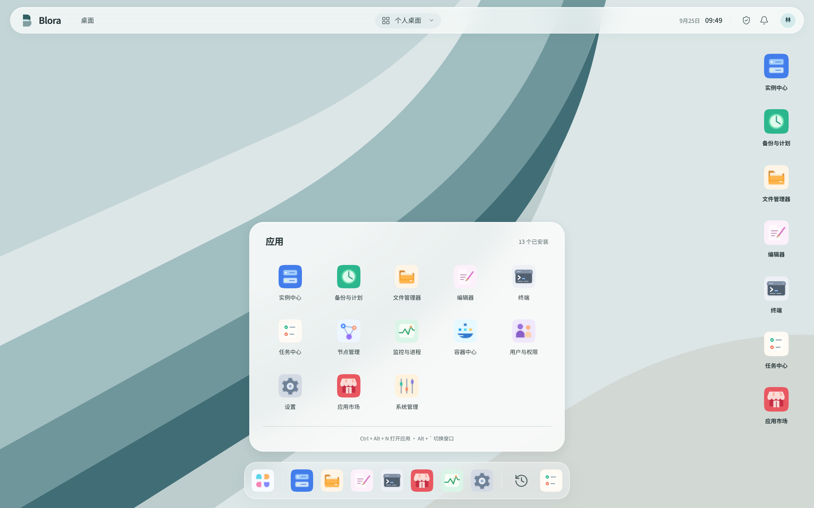
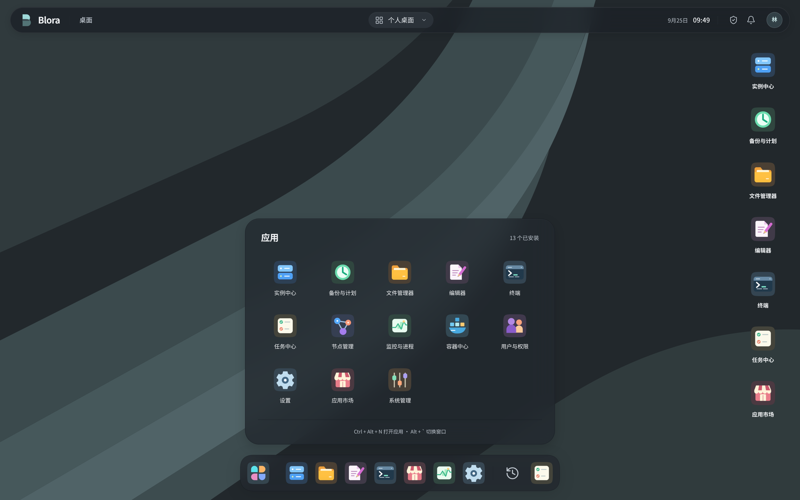

<p align="center">
  
</p>

<h1 align="center">Blora Panel</h1>

<p align="center">
  <strong>A desktop workspace for your servers.</strong><br>
  Manage nodes, instances, files, terminals, containers, and backups from one desktop.
</p>

<p align="center">
  <strong>English</strong> · <a href="README.zh-CN.md">简体中文</a>
</p>

<p align="center">
  
  
  
  
</p>

<p align="center">
  <a href="#quick-start">Quick start</a> ·
  <a href="#production-startup">Production startup</a> ·
  <a href="#features">Features</a> ·
  <a href="#documentation">Documentation</a> ·
  <a href="sdk/README.md">Extension SDK</a>
</p>

<p align="center">
  <picture>
    <source media="(prefers-color-scheme: dark)" srcset="web/ui-screenshots/all-appearance-20260926/mineral-dark-on-launcher.png">
    
  </picture>
</p>

<p align="center">
  <sub>Light and dark appearance · Six color palettes · Independent translucent materials</sub><br>
  <sub>Screenshots show the current Chinese UI with isolated demo data.</sub>
</p>

<details>
<summary>View both light and dark screenshots</summary>

| Light | Dark |
| :---: | :---: |
|  |  |

</details>

## Features

Blora Panel brings server management into a Material Design 3–inspired desktop, with Go services handling operations independently of the browser.

| Area | What you can do |
| :--- | :--- |
| **Desktop workspace** | Open multiple windows and tabs, move views between windows, create resource shortcuts, and recover your workspace after a refresh. |
| **Instances & nodes** | View authorized resources across nodes, control instance lifecycles, manage quotas, enroll nodes, and rotate node identities. |
| **Files & editor** | Browse files, transfer data between nodes, and edit with Monaco, including recovery of unsaved text and undo history. |
| **Terminals & monitoring** | Use PTY terminals, inspect bounded log archives, follow metrics, and track persistent tasks. |
| **Docker & Compose** | Manage containers and Compose projects through authorized node operations, with task tracking and recovery. |
| **Backups & schedules** | Create backups, review restore plans, configure schedules, and run administrator-defined application hooks. |
| **Users & extensions** | Apply resource permissions and role templates, install and upgrade apps, and build extensions with the standalone SDK. |

Closing a window does not stop its instance. Opening a resource shortcut does not start it. Translucency, color palette, and light/dark appearance are independent settings.

## Quick start

**Tested toolchain:** Linux amd64, Go **1.25.9**, Node.js **24.15.0**, and npm **11.12.1**. Use GNU Make; release packaging also requires Python **3.9+**. Dependency versions are pinned in `go.mod`, `go.sum`, and the npm lockfiles.

```sh
git clone https://github.com/BloretCrew/BloraPanel.git
cd BloraPanel

make build
make web
make sdk
make fixture
```

| Command | Result |
| :--- | :--- |
| `make build` | Builds `dist/blora-master` and `dist/blora-daemon`. |
| `make web` | Installs locked frontend dependencies and builds `web/dist`. |
| `make sdk` | Builds the SDK and three reference extension packages. |
| `make fixture` | Starts a local Master and two Daemons with isolated test accounts and resources. |

Open the URL printed by the fixture; the default is **`https://127.0.0.1:9443`**. It creates a local test certificate and a private `.local/fixture-*` directory. Random administrator and member credentials are written to `browser-credentials.json` with mode `0600`; there is no reusable default password.

The member account has restricted access to two test instances and no instance-creation or host-shell permission. Instances start in the stopped state. Press **Ctrl+C** to stop the fixture's resources and services; its private logs remain available for diagnosis.

<details>
<summary><strong>Connect your own nodes</strong></summary>

### Initialize the Master

Copy [master.example.json](master.example.json) to `dist/master.json` beside the compiled executable. For this source-build layout, set `staticDir` to `../web/dist`; extracted Master archives already place `web/dist` beside the binary. Create the configured `dist/initial-password` file with a local editor: mode `0600`, password of 12–72 bytes. Keep credentials out of shell arguments and the repository.

```sh
./dist/blora-master
```

First startup initializes the administrator from the private password file. Later starts reuse the database. Master serves local HTTP; public HTTPS/certificates belong in Nginx.

### Enroll a Daemon

Sign in, generate a one-time enrollment ticket in the node application, and save it as a private file on the node. Save a separate `daemon.json` beside each Daemon executable:

```json
{
  "stateDir": "/absolute/private/blora-node-a",
  "masterUrl": "http://127.0.0.1:37861",
  "enrollmentFile": "/absolute/private/node-a.enrollment",
  "allowPGIDFallback": false
}
```

```sh
./dist/blora-daemon
```

Each Daemon needs its own state directory and identity. Local HTTP needs no CA file; remote connections use your Nginx HTTPS entry. An enrolled node reuses its identity rather than consuming another ticket.

Native Linux instances require an administrator-delegated, writable `cgroupRoot`. Administrators running trusted workloads can explicitly enable `allowPGIDFallback`; process groups do not provide host isolation for ordinary users. Isolated user workloads require a configured `dockerEndpoint`, a prepared image, and the appropriate permissions.

See the [operations guide](docs/operations/OPERATIONS.md) for state directories, health checks, consistent backups, upgrades, and rollback. [Administration evidence](docs/acceptance/reports/administration.md) covers quotas, roles, account changes, node maintenance, and key rotation. Rotation preserves the node ID and resource associations; log helpers and Windows Job keepers run independently of open browser views.

</details>

## Production startup

Both programs start with **no arguments**. Master reads `master.json` and Daemon reads `daemon.json` **beside their executable**, regardless of the working directory. Relative configuration/data paths also use that executable directory. Omitted paths default to `state/master`, `state/daemon`, and Master's `web/dist`; a custom configuration can still be selected with `--config`.

Master defaults to **`http://127.0.0.1:37861`**. Set `listen` to `0.0.0.0:37861` to bind all IPv4 interfaces; HTTP/WS also supports remote clients. Nginx can terminate HTTPS/WSS without local certificates on Master or Daemon.

**Version scope:** [v0.1.0-beta.4](https://github.com/BloretCrew/BloraPanel/releases/tag/v0.1.0-beta.4) supports direct remote HTTP and includes a browser UUID fallback for login and other requests in non-secure HTTP contexts. beta.2 and beta.3 do not include both fixes.

### 1. Master

Install the binary and `web/dist` at `/opt/blora/master`. Save the [production example](docs/operations/examples/master.json) as **`/opt/blora/master/master.json`**:

```json
{
  "stateDir": "/var/lib/blora/master",
  "listen": "127.0.0.1:37861",
  "staticDir": "/opt/blora/master/web/dist",
  "extensionsDir": "/var/lib/blora/master/extensions",
  "adminName": "admin",
  "passwordFile": "/etc/blora/initial-password",
  "verifyProxyIPs": false
}
```

Create the configured `passwordFile` with a local editor (12–72 bytes, readable only by the Master account). On its first start, Master initializes the administrator and then serves the panel; subsequent starts reuse its database:

```sh
sudo -u blora-master /opt/blora/master/blora-master
```

Or, from the program directory: `./blora-master`. Open **`http://127.0.0.1:37861`** locally. After signing in, delete the initial password file. Keep config/secrets private (`0600`), state directories `0700`, owned by the runtime account. The [portable template](master.example.json) uses relative paths; ensure its executable directory permits creation of those state directories.

### 2. Daemon

Install Daemon on each managed machine at `/opt/blora/daemon`. Generate a one-time enrollment ticket in the panel and save it privately. Put [daemon.json](docs/operations/examples/daemon.json) beside the executable:

```json
{
  "stateDir": "/var/lib/blora/node",
  "masterUrl": "http://127.0.0.1:37861",
  "enrollmentFile": "/etc/blora/node.enrollment",
  "allowPGIDFallback": false
}
```

```sh
sudo -u blora-daemon /opt/blora/daemon/blora-daemon
```

Or, from the program directory: `./blora-daemon`. The [portable template](daemon.example.json) defaults to local Master and relative enrollment/state paths. An enrolled Daemon reuses its own identity; remove the ticket and `enrollmentFile` after enrollment. Each Daemon needs a separate state directory.

For another machine, set `masterUrl` to the reachable Master URL. Prefer the **Nginx HTTPS URL** when available; plain HTTP is also supported. System-trusted Nginx certificates need no `caFile`; a private CA may be supplied there. Daemon connects outbound, with no inbound management port. Run a Daemon on the Master machine too if you want to manage that host.

Linux native instances require an administrator-prepared writable `cgroupRoot`; Docker/Compose requires `dockerEndpoint` and runtime dependencies. `allowPGIDFallback` is for explicitly trusted workloads, not ordinary user isolation.

### 3. Frontend / Nginx

Master already serves `web/dist`: **no independent Node.js or Web server process is required**. For external access, use the [Nginx example](docs/operations/examples/nginx.conf): Nginx owns HTTPS/certificates and proxies API/WebSocket connections to **`http://127.0.0.1:37861`**. Keep frontend/API on the same origin. An independent Web archive can instead be served by Nginx by changing its static `root`.

By default `verifyProxyIPs` is **false**: Master accepts forwarding headers without a proxy IP list. It cannot identify Nginx from a header, so keep the backend on loopback and have Nginx overwrite `X-Forwarded-Host/Proto/For` and `X-Real-IP`, as the example does. Host/protocol determine browser Origin and cookie security; client IP drives login limits. Invalid/ambiguous headers are rejected.

To require a proxy IP allowlist, change these fields in `master.json` and restart with the same command:

```json
{
  "verifyProxyIPs": true,
  "trustedProxies": ["127.0.0.1/32", "::1/128"]
}
```

When this switch is on, a nonempty IP/CIDR list is required. Headers from other peers are ignored. Multiple trusted proxies require a sanitized chain; the single-proxy example replaces XFF with the actual client address rather than appending untrusted input.

<details>
<summary><strong>Optional Master settings</strong></summary>

| Setting | Purpose |
| :--- | :--- |
| `stateDir`, `listen`, `staticDir` | Persistent data, listening address, built frontend. |
| `adminName`, `passwordFile` | First-start administrator and private password-file path. |
| `verifyProxyIPs`, `trustedProxies` | Optional strict proxy allowlist. |
| `origin` | Optional fixed browser origin; normally detected automatically. |
| `extensionsDir` | Persistent extension registry; omit to disable installation. |
| `extensionsCatalog`, `extensionsCatalogUrl` | Optional local / HTTPS extension catalog. |
| `extensionsPublicKey` | 32-byte hex Ed25519 public key for mandatory package signatures. |
| `https`, `tlsCert`, `tlsKey` | Optional direct HTTPS compatibility mode; normally omitted when Nginx terminates TLS. |

Configuration changes take effect on restart. Unknown JSON fields/invalid settings fail before opening the database. `--init` remains available to initialize and exit; it refuses to replace an existing administrator. Old flag-based fixture scripts remain supported.

</details>

<details>
<summary><strong>Linux services / Windows startup</strong></summary>

Use the [Master unit](docs/operations/examples/blora-master.service) and [Daemon unit](docs/operations/examples/blora-daemon.service). Prepare their named accounts, sibling JSON files and private state directories before installing the units:

```sh
sudo systemctl daemon-reload
sudo systemctl enable --now blora-master.service
sudo systemctl enable --now blora-daemon.service
```

Daemon's `KillMode=process` preserves independently owned runs/log helpers. Online updates replace only the management child. Follow the quiescence procedure for consistent state backups or incompatible maintenance upgrades.

On Windows, put `master.json` beside `blora-master.exe`, `daemon.json` beside `blora-daemon.exe`, and edit absolute paths to Windows paths such as `C:/Blora/state/master` (or use the portable templates' relative paths):

```powershell
& 'C:\Blora\master\blora-master.exe'
& 'C:\Blora\daemon\blora-daemon.exe'
```

These are console programs, not native SCM executables. A supervisor must preserve private state and independent helpers. Current Windows builds are cross-compiled; this change has not been newly device-certified.

</details>

Check local health with `curl --fail http://127.0.0.1:37861/healthz`; check the configured external Master URL as well. Health checks cover Master's database, not all node capabilities. No production host is changed by these instructions.

### Online updates

Administrators can update **Master in Settings** and **Daemon in Node Management**. The updater downloads prebuilt Release archives; the installed machine needs no Git, Go, Node.js or local compilation. Check first, review the pinned version and compatibility, then apply. Running managed instances keep their process identity; the management connection reconnects, while interactive terminal sessions may disconnect and browser uploads may need resuming.

Both configuration files accept the same optional source settings:

```json
{
  "updates": {
    "repository": "https://github.com/BloretCrew/BloraPanel",
    "channel": "beta"
  }
}
```

Omitting these settings uses this repository and the `beta` channel. `stable` excludes prereleases. An optional `updates.apiUrl` selects an HTTPS **GitHub-compatible API mirror**, including release assets and tag/commit endpoints; an ordinary file directory is insufficient. The selected repository/mirror supplies executable code and must be trusted. Settings saved in the panel are persisted privately under the update state directory and override the initial JSON source defaults.

The updater verifies `SHA256SUMS`, `CORE-UPDATE.json`, archive paths and per-file `MANIFEST.json`, then checks the binary's embedded compatibility information. A stable launcher prepares an immutable version directory and switches only after the previous management child exits. Configuration, identities, databases and instance directories remain in their original locations. Failed candidate startup returns to the previous version. The bundled frontend follows Master; a separately configured frontend remains administrator-managed.

Compatibility is required, rather than assumed from the version number: mismatched database migration fingerprints, unsupported peer protocols or uncertain live-instance ownership block an online update. Incompatible architecture/schema changes need a maintenance procedure; the updater does not run database downgrades or a patch chain. Missing update metadata also blocks old archives, including `v0.1.0-beta.1`. Manually install beta.2 once before using the update controls for subsequent compatible Releases. New Windows update runtime behavior still requires device validation.

Use a separate production installation, such as `/data/instances/blora-panel-runtime`, instead of placing live state in this development checkout. See the [update and production directory contract](docs/plan/Blora-03-在线更新与生产部署.md).

## Architecture

| Component | Responsibility |
| :--- | :--- |
| **Frontend / Desktop** · Vue 3 / TypeScript | Runs in the browser: windows, tabs, default apps, extension hosting, user interaction and local workspace recovery. Distributed as static files, served by Master or a web server. |
| **Master** · Go | Central management service: accounts/sessions, server-side authorization, node enrollment, resource indexes, persistent task coordination and the API/WSS gateway. Usually one per deployment; it can also serve the frontend. |
| **Daemon** · Go | Execution service on each managed machine: local process lifecycle, PTYs, files, Docker/Compose, backups, monitoring and task execution/reporting. Only resources on a machine with a Daemon can be managed there. |

Nodes establish outbound management connections to the Master. The Master can serve management traffic over HTTPS/WSS or HTTP/WS; choose the listener address and transport that fit the deployment. Managed services keep their own business networking. Resource authorization is enforced on the server, and extensions do not receive host command execution by default.

The normal management path is **browser frontend → Master → target Daemon**. The SDK is an extension-development toolkit, not a fourth running service. Closing the browser does not stop server-side instances, schedules or tasks; an offline node remains offline/unknown in the UI rather than being reported as stopped.

```text
cmd/        Master, Daemon, fixtures, and helper entry points
internal/   Backend services, protocol, storage, and platform adapters
web/        Vue desktop, default applications, and browser tests
sdk/        Standalone app SDK and reference extension
scripts/    Packaging and validation tools
docs/       Design, API, operations, and acceptance records
```

## Development

```sh
make check
make test
npm --prefix web test
npm --prefix web run test:e2e
```

The mock browser runner defaults to `/usr/bin/chromium-browser`; set `BLORA_CHROMIUM` to another Chromium executable when needed. Race tests require a supported native platform and a C toolchain. Tests that depend on Docker, delegated cgroups, or other platform capabilities have separate prerequisites and evidence.

<details>
<summary><strong>Real browser and fault validation</strong></summary>

With the local fixture running, use its private credential file:

```sh
BLORA_E2E_CREDENTIALS=/absolute/private/fixture/browser-credentials.json npm --prefix web run test:e2e:real
```

The real runner uses Playwright's installed browsers by default; `BLORA_CHROMIUM` can select a system Chromium. The [local regression guide](docs/operations/LOCAL_REGRESSION.md) includes a current-source Linux runner that builds the project, owns its HTTPS fixture and runs the complete real functional suite. Private credentials and raw evidence stay outside version control. See the [desktop report](docs/acceptance/reports/desktop-2026-09-09.md) for individual scenario setup.

**Sustained mixed load.** Start `./dist/blora-devfixture --performance`, then run in a second terminal:

```sh
BLORA_E2E_CREDENTIALS=/absolute/private/fixture/browser-credentials.json BLORA_PERF_SOAK_SECONDS=3600 npm --prefix web run test:e2e:real -- tests/real/performance.spec.ts
```

This exercises eight windows, two continuously producing PTYs, a directory with 10,000 entries, and repeated cross-node copies. Do not replace the frontend build or run competing heavy tests during measurement. Linux resource sampling is available through `python3 scripts/performance-resources.py .local/fixture-ID --samples 62 --interval 60`. Stop the sampler and the owned fixture after the test. Current results, including failed performance thresholds, are recorded in the [performance report](docs/acceptance/reports/performance-current-2026-09-26.md).

**Isolated disk-full validation.** This requires private Linux user/mount namespaces and uses a 1 MiB tmpfs in an owned test directory:

```sh
BLORA_TEST_ENOSPC=1 go test -race ./internal/master -run 'ENOSPC' -count=1 -v
```

**Isolated firewall validation.** This additionally needs private network namespaces, firewalld, firewall-cmd, nft, ip, and dbus-broker-launch:

```sh
BLORA_TEST_FIREWALL_NAMESPACE=1 go test -race ./internal/master -run '^TestPrivateFirewalldApplyAndRestore$' -count=1 -v
```

These fault tests only operate on their own isolated resources. A skipped test is not a passing result. See the [disk-full report](docs/acceptance/reports/enospc-2026-09-19.md) and [firewall report](docs/acceptance/reports/firewall-private-2026-09-19.md).

</details>

<details>
<summary><strong>Containers, backup hooks, and app registries</strong></summary>

Build the isolated instance image:

```sh
docker build -f Dockerfile.isolated -t blora/isolated:local .
```

The image uses a non-root user and includes the fixed-path exec helper. The adapter restricts privileges, resources, and mounts; PTY cleanup checks process identity before ending its own exec. See the [container terminal report](docs/acceptance/reports/terminal-container-2026-09-09.md).

Linux Daemons reconcile owned leftover Compose CLI processes on startup. If `recover Compose CLI ownership` fails, preserve `containers/cli-runs/`, investigate record integrity and process inspection permissions, then restart. New Engine mutations remain blocked until ownership is resolved; CLI exit alone does not prove remote rollback. See the [Compose recovery report](docs/acceptance/reports/compose-cli-recovery-2026-09-13.md).

Open the backup application from an instance's **Backups & schedules** entry. Restores use version checks, an immutable plan, explicit overwrite confirmation, and persistent tasks. Optional hooks are administrator-defined argv mappings in the Daemon configuration:

```json
{
  "backupRoot": "/absolute/private/node-a-backups",
  "backupHookCommands": {
    "backup.save.before": ["/absolute/private/bin/app-save", "--instance"],
    "backup.save.after": ["/absolute/private/bin/app-resume", "--instance"]
  }
}
```

Hooks do not run through a shell. Resource identity and hook ID are passed through `BLORA_BACKUP_*` environment variables; an unconfigured policy reports unavailable capability.

Set `extensionsCatalog` in Master's JSON for a local registry, or `extensionsCatalogUrl` for an HTTPS registry. These options are mutually exclusive; remote registries reject redirects. Enabled apps load authenticated bundles in an opaque-origin `sandbox="allow-scripts"` iframe and use the host's authorized capability and task bridge. See the [SDK documentation](sdk/README.md) for package construction, signatures, installation, upgrades, rollback, and data migration.

</details>

<details>
<summary><strong>Build release archives</strong></summary>

After the dependency setup above:

```sh
BLORA_VERSION=development-YYYYMMDD make package
cd dist/releases/development-YYYYMMDD
sha256sum -c SHA256SUMS
```

Packaging creates six archives: Linux and Windows Master/Daemon, a standalone frontend, and the SDK. Master archives include the frontend; Daemon archives include isolated-image build inputs; SDK archives include reference source, packages, and signing tools for both platforms. See the included `START.txt` for SDK build instructions.

Each archive also contains a per-file `MANIFEST.json`. Fixed timestamps, ordering, and modes make packaging reproducible for identical inputs; a conflicting existing version is rejected. Source or documentation changes require a new version. Archives exclude runtime identities and `node_modules`. See the [RC24 release report](docs/acceptance/reports/release-rc24-2026-09-27.md) for actual smoke, restore, and compatible rollback results.

`make package` collects upstream licenses and notices offline from compiled Go dependencies and locked npm packages. Missing license material stops packaging. If Go license files live outside `GOROOT`, set `BLORA_GO_LICENSE_DIR`; Fedora's `/usr/share/licenses/golang` is recognized by default.

</details>

## Project status

**Blora Panel is in active development.** Implementation and verification are tracked separately in the [acceptance matrix](docs/acceptance/ACCEPTANCE_MATRIX.md).

The current prebuilt prerelease is **[v0.1.0-beta.5](https://github.com/BloretCrew/BloraPanel/releases/tag/v0.1.0-beta.5)**. It includes zero-argument startup, prebuilt core updates, direct remote HTTP, browser UUID fallback, custom dropdown controls, desktop/window/tab transitions, and daemon-node-scoped file management. Automated and agent-run validation do not replace the owner's hands-on evaluation; stable-release readiness is not claimed.

[Non-release source closeout](docs/acceptance/reports/non-release-closeout-2026-10-08.md) covers backend race checks, builds, 123 frontend units, all 51 real functional scenarios across a complete run and independent follow-ups, recovery repairs and strict native rendering checks. Earlier failures and the limits of combined evidence remain visible. Beta package validation followed that source closeout; the stable release awaits hands-on evaluation.

[Ordinary Windows real-device validation](docs/acceptance/reports/windows-device-passed-2026-10-06.md) passed all fourteen checks; earlier native Job/ConPTY and visible-WebKit results retain their fixed-source scope. The new beta Windows archives have not been rerun on a Windows device. The [current remaining-work record](docs/execution/NON_UI_REMAINING_2026-09-26.md) distinguishes the delivered beta from pending stable-release evaluation. Extra physical-failure and deployment combinations were waived for this delivery, rather than marked as passed.

[E08 optimization is closed under the user's adjusted scope](docs/acceptance/reports/e08-bounded-closeout-2026-10-08.md): Chromium measured 38.8ms, Firefox 66ms, and WebKit 89–132ms, with its last repetition at 95ms. The original universal 50ms target remains unmet; these source-specific stress results do not guarantee every run stays below 100ms.

Real systemd service/timer lifecycles and delegated cgroup process control have [isolated Linux container evidence](docs/acceptance/reports/systemd-cgroup-2026-09-29.md), including CPU throttling and bounded memory/PID exhaustion. [Native Linux notification rendering and mouse clicks](docs/acceptance/reports/native-notifications-2026-09-29.md) are also verified with X11/Dunst. Each report covers its stated environment; the [platform guide](docs/operations/PLATFORM_VALIDATION.md) provides reproducible runners. Production deployment and other platform combinations are not certified by local regression.

The repository includes source, tests, dependency lockfiles, documentation, and the two README screenshots. Credentials, runtime databases, installed dependencies, release archives, generated reference packages, and the remaining historical screenshot galleries stay outside version control.

## Documentation

Detailed engineering documents and the SDK guide are currently maintained in Chinese.

| Guide | Contents |
| :--- | :--- |
| [Operations](docs/operations/OPERATIONS.md) | State layout, health checks, backups, upgrades, and rollback. |
| [Platform validation](docs/operations/PLATFORM_VALIDATION.md) | Windows, systemd, remote Engine, and fault-validation procedures. |
| [Local regression](docs/operations/LOCAL_REGRESSION.md) | Current-source builds, ordinary browser checks, real functional validation and opt-in experiments. |
| [API specification](docs/api/openapi.yaml) | Requests, authorization, idempotency, tasks, WebSockets, and structured errors. |
| [Extension SDK](sdk/README.md) | App manifests, sandbox capabilities, signatures, and lifecycle contracts. |
| [Acceptance matrix](docs/acceptance/ACCEPTANCE_MATRIX.md) | Implemented, verified, pending, and environment-dependent requirements. |
| [Execution progress](docs/execution/PROGRESS.md) | Latest engineering decisions, evidence, and remaining work. |
| [Technical architecture](docs/plan/Blora-01-技术架构.md) | Master/Daemon architecture and core technical contracts. |
| [Features & interaction](docs/plan/Blora-02-功能与交互.md) | Product scope, applications, and workspace behavior. |

The API's `sessionCookie`, `X-CSRF-Token`, and `Idempotency-Key` describe checks performed by the actual Master. Resource-specific response bodies are defined by their respective applications.

## Third-party notices

Blora Panel is licensed under the **GNU General Public License version 3 only** (SPDX: `GPL-3.0-only`); see [LICENSE](LICENSE). Third-party components retain their own licenses. Their original texts and notices are recorded in the [dependency inventory](docs/licenses/inventory.json) and [third-party notices](docs/licenses/THIRD-PARTY-NOTICES.txt), and accompany the release archives.
