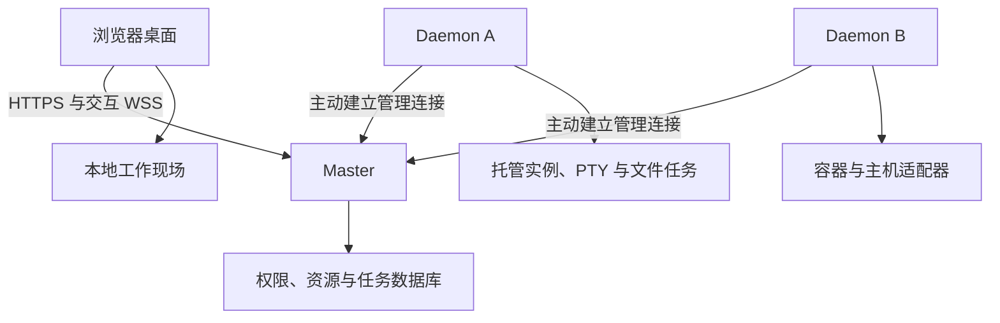

# Blora Panel 策划案 · 第一部分：技术实现与架构选择

版本：v0.3 · 2026-09-08  
定位：可用于拆解研发任务的架构基线；文中性能数字均为待验证的设计目标。  
配套文档：[第二部分：用户功能、边界与操作体验](Blora-02-功能与交互.md)。

本次修订：明确默认应用与扩展应用的统一模型；增加实例跨节点聚合、多窗口、多标签、标签移入移出窗口、实例桌面快捷方式，以及对应的权限、状态和验收要求。

## 1. 已确认的需求与设计原则

Blora Panel 是面向服务器进程与主机运维的多用户、多节点管理平台，前后端分离，以具有窗口、桌面和多任务能力的浏览器工作环境作为核心产品形态。

本版依据用户澄清固定以下要求：

1. **管理连接与业务服务网络分开。** Daemon 主动连接 Master，平台负责管理通信。游戏、网站、数据库等被管理服务的端口、域名和外部访问由用户独立配置。业务穿透、玩家流量代理、VPN 不进入核心范围；未来可以作为独立应用或插件接入。
2. **网页刷新恢复完整工作现场。** 打开的窗口、未保存的文件内容、编辑位置、应用标签、选择与滚动状态等均属于持久化设计范围。恢复不能仅靠重新打开相同文件。
3. **实例重启必须有确定的处理流程。** 停止、升级为强制结束、确认旧进程退出、再次启动都应可观察、可超时、可诊断。不得让实例永久停在“关闭中”，也不得在旧实例仍存活时重复启动。
4. **刷新恢复与后台进程生存是两个需求。** 本版不把“Daemon 重启后所有 PTY 永久存活”作为新增硬性目标，也不因此引入独立监督服务架构。
5. **桌面操作先本地反馈，远程结果由实际执行确认。** 拖动、选中和窗口切换不依赖网络；停止服务、保存远程文件等展示真实执行阶段。
6. **权限和恢复从首个可用版本接入。** 应用不能先靠前端隐藏按钮实现权限，再在后续阶段补安全边界。
7. **绝大部分用户功能以应用交付。** 基础功能作为默认安装的应用；后续扩展通过应用开发接口提供新功能。桌面、应用宿主和公共能力保持稳定，避免每增加应用都修改桌面核心。
8. **一个应用可以拥有多个窗口，一个窗口可以拥有多个资源标签页。** 实例中心默认聚合当前用户所有可见实例，允许在获准节点创建实例；不同标签可以指向不同节点，同一实例也可以有多个管理视图。
9. **资源可以成为桌面快捷入口。** 将实例添加到桌面只创建资源快捷方式；打开时直接进入该实例的独立管理窗口，不复制、不自动启动实例，也不新增一套应用实现。

## 2. 技术基线与部署方式

### 2.1 确定的技术选择

| 层次 | 本版选择 | 选择依据与约束 |
| --- | --- | --- |
| Master / Daemon | Go；模块化单体，各自独立进程 | 并发 I/O、操作系统适配和分发较直接；不按功能拆微服务 |
| HTTP 服务 | Go net/http；统一中间件 | 认证、超时、请求标识、限流和错误结构一致；不以框架跑分决定架构 |
| 前端 | Vue 3、TypeScript、Vite | 固定一条实现路线，应用按需加载 |
| 桌面状态 | Pinia + 独立状态持久化服务 | 管理窗口、焦点、布局、应用现场；不把终端字节流塞进响应式对象 |
| 服务器资源缓存 | TanStack Vue Query + 版本化事件更新 | 查询、失效、重新拉取有统一入口；恢复时以节点事实校准 |
| 样式与基础控件 | CSS 变量设计令牌、Tailwind CSS、VueUse | 窗口管理器自行实现，输入、菜单、对话框沿用可访问性语义 |
| 动效 | CSS 为基础，复杂过渡使用 Motion for Vue | 动画不决定窗口最终坐标；支持减少动效 |
| 终端 | @xterm/xterm、fit / serialize / WebGL 插件 | WebGL 可降级；终端状态恢复和输出流控是独立模块 |
| 编辑器 | Monaco Editor + Web Workers | 编辑模型、草稿、撤销历史由应用适配层管理 |
| 浏览器持久化 | IndexedDB（idb 封装）+ sessionStorage 小型恢复日志 | 前者存快照与大状态，后者保护同标签刷新前尚未异步落库的变更尾部 |
| 服务端元数据 | SQLite + database/sql + modernc.org/sqlite | Master、每个 Daemon 各用本地数据库；显式 SQL 迁移 |
| 实时管理通信 | WSS + Protobuf；Go 端使用 coder/websocket | 浏览器与节点均使用 WSS，但通道和协议职责不同；首版不维护并行 gRPC 实现 |
| 文件传输 | 浏览器 HTTPS 分片 + 节点主动建立的独立批量数据通道 | Master 有界流式转发，不要求浏览器直连节点 |
| 分发 | Master / Daemon 独立发行包；前端可独立托管或内嵌 Master | 代码、协议和部署解耦；内嵌静态资源不改变前后端分离 |

TanStack Vue Query 的职责是服务器状态获取与缓存；Motion 的 Vue 包为 motion-v；modernc.org/sqlite 提供不依赖 CGO 的 SQLite 驱动。版本在实现时锁定，并纳入升级验证。[Vue Query 文档](https://tanstack.com/query/latest/docs/framework/vue/overview)、[Motion 文档](https://motion.dev/docs/vue)、[SQLite 驱动文档](https://pkg.go.dev/modernc.org/sqlite)

首版使用单 Master。多用户、多节点不要求多 Master；也不默认引入 Redis、消息队列服务器或 PostgreSQL。达到高写入并发、外部数据库运维或控制面高可用需求时再增加 PostgreSQL 适配和迁移工具，不承诺换驱动即无缝迁移。[SQLite 适用场景](https://www.sqlite.org/whentouse.html)

Go WebSocket 实现选用支持 context 的成熟库，连接建立、读写、关闭仍由平台统一施加期限和限额。[coder/websocket 项目](https://github.com/coder/websocket)

### 2.2 总体关系

图中只有管理关系。被管理服务面向客户端的网络连接不经过此架构。

Master 是管理入口和数据中继；节点失联或 Master 暂时不可用，不触发正在运行的实例自动停止。离线期间，节点仅继续已授权且已接受的本地工作。

## 3. 模块职责与数据归属

### 3.1 Master

负责账号与会话、资源授权、节点登记、管理连接、实例配置、全局任务索引、桌面云端副本、审计和文件流中继。

Master 数据库保存“用户想让系统做什么”和管理关系；实例运行事实由 Daemon 上报。Master 重启后先恢复任务记录和订阅，再与节点对账，不凭旧数据库状态直接宣布实例仍在运行。

### 3.2 Daemon

负责实际进程启动停止、PTY、文件访问、容器适配、指标采集、任务执行和本地恢复记录。

每个 Daemon 有本地 SQLite：保存操作幂等记录、实例运行代次、任务阶段、传输检查点和事件游标。日志、上传分片和备份数据位于独立文件存储目录，不作为大 BLOB 持续写入元数据库。

特权操作收敛到有限接口：创建隔离环境、以指定身份启动进程、终止已归属的运行单元等。普通文件和实例操作不直接转成拥有宿主机最高权限的任意 shell 命令。

### 3.3 前端

前端分成桌面外壳、应用宿主、默认/扩展应用、工作现场存储、资源缓存和实时流管理层。默认业务应用通过应用宿主接入公共能力；其业务页面不直接写进桌面外壳。

每个窗口绑定 appId 和工作区，每个具体资源标签页或面板绑定明确的 resourceRef。实例中心的总览标签可以跨节点查询，同一窗口的不同标签可以管理不同节点的实例。标题和操作上下文按活动标签展示目标；列表筛选不会改变已打开资源标签的绑定。

窗口和应用标签关闭只释放相应视图引用；资源缓存与订阅按引用计数共享，远程任务、终端会话、文件草稿仍由各自的服务管理。打开另一管理视图不产生另一份服务器运行实例。

### 3.4 共同实体

| 实体 | 关键字段 | 权威来源 |
| --- | --- | --- |
| Node | nodeId、身份公钥、连接代次、能力、最近在线时间 | Master 身份记录 + Daemon 探测 |
| Instance | instanceId、nodeId、运行配置、授权、配置版本 | Master |
| InstanceRun | runId、instanceId、启动标识、归属单元、观察状态 | Daemon |
| Operation / Task | taskId、requestId、资源、执行阶段、结果、检查点 | Master 索引 + Daemon 执行记录 |
| TerminalSession | sessionId、runId、写入租约、尺寸、输出游标 | Daemon |
| Workspace | userId、deviceId、browserTabId、workspaceId、schemaVersion、revision | 本地现场；云端副本有独立版本 |
| AppManifest | appId、包版本、宿主 API 版本、入口、能力、窗口及标签策略 | 默认包或经授权安装的扩展包 |
| AppWindow | windowId、appId、workspaceId、展示模式、窗口布局、标签顺序、活动标签 | 当前用户的工作现场 |
| AppViewTab | viewTabId、所属窗口、视图类型、resourceRef/查询范围、局部状态 | 工作现场；资源事实由资源服务提供 |
| DesktopShortcut | shortcutId、userId、workspaceId、appId、目标资源、入口、显示名称、打开策略 | 用户工作区；不携带授权凭据 |
| DocumentDraft | 文件身份、基线版本、正文、编辑日志、视图状态 | 用户草稿存储 |

UUID 或其他全局标识只解决标识冲突，不具有权限含义。进程 PID 必须与运行代次和操作系统启动标识共同使用，不能单独作为长期身份。

## 4. 管理连接、协议与流控

### 4.1 连接与身份

节点安装时生成本地身份密钥，通过有时效、一次性登记凭据加入 Master。首版采用服务器 TLS + 节点密钥签名挑战完成 WSS 身份认证，使用标准密码库，不自行实现 TLS。挑战绑定节点、短期随机数和本次连接，验证后形成连接代次；旧挑战不能重放。

选择应用层节点认证，是为了兼容常见 HTTPS 反向代理。mTLS 可作为后续部署增强，不作为首版反向代理接入的前置条件。Master 支持按部署配置使用 HTTPS/WSS 或 HTTP/WS；Daemon 的出站管理传输随 Master 地址选择对应协议。

节点凭据轮换、吊销、重复连接替换和审计从首版提供。连接代次更新后，旧连接不能继续下发或完成新的写操作。

浏览器使用 HttpOnly、Secure、合适 SameSite 策略的会话 Cookie；改变状态的 HTTP 请求检查 CSRF，WSS 握手检查 Origin。独立托管前端需明确配置允许来源。节点身份凭据与用户登录凭据分开。

### 4.2 通道分工

| 通道 | 内容 | 阻塞时的处理 |
| --- | --- | --- |
| 控制 | 指令、鉴权、心跳、任务状态 | 高优先级、短消息、独立有界队列 |
| 交互 | 终端输入输出、日志订阅、实时指标 | 每个逻辑流独立额度与游标；慢订阅者单独处理 |
| 批量数据 | 上传、下载、跨节点复制 | 独立物理通道、并发上限和速率预算 |

同一域名可以承载多条连接。物理连接数量按节点与活跃负载受控，不为每个指标创建连接。文件通道不与停止指令共用一个先进先出的发送队列。

### 4.3 协议最低要求

协议版本进入握手，并明确消息大小、流类型及向前兼容规则。包络至少表达：连接代次、通道标识、请求标识、运行代次、消息类型、序号、负载。

消息族包含 OPEN / OPEN_ACK、DATA、CREDIT / ACK、RESIZE、CLOSE / RESET、ERROR、RESUME、PING / PONG、TASK_EVENT。序号按流和方向定义，不能混用终端输出序号与任务修订号。

所有修改操作采用稳定 requestId；节点将 requestId、请求摘要和接受状态先记账，再执行。相同 ID、相同内容返回既有结果；相同 ID、不同内容拒绝。已接受、执行中、执行成功是不同阶段。

重连只补发可安全重放的操作。终端输入、尚未确认的 shell 命令不得自动重发。对接受状态不明的修改请求，先查询 requestId 再决定后续动作。

### 4.4 端到端流控

以“消费者已处理多少数据”发放额度，不能把 socket 已写出视为浏览器已消费。设置每流和全局缓冲上限、最大消息、活跃订阅上限；超限时对对应流背压、暂停或显式报告缺口。

节点持续读取并归档托管实例输出，不能因为一个网页很慢就无限阻塞游戏服务的 stdout。单个慢客户端落后时，从日志读取补偿；超出保留范围显示缺口。PTY 可施加受控背压，但不能无限持有内存。

终端在 xterm 完成解析后确认已处理额度。WebGL 只解决部分渲染成本，不能替代流控。[xterm 流控文档](https://xtermjs.org/docs/guides/flowcontrol/)

中继目标是有界内存和减少无效复制，不承诺端到端零拷贝。TLS、消息编码及 WebSocket framing 都需纳入实际成本测量。[Go io.Copy 文档](https://pkg.go.dev/io#Copy)

### 4.5 掉线和补偿

心跳建议 15 秒一次，失联判定按连续超时配置；重连采用指数退避和随机抖动，最大间隔建议 30 秒。数值是可调默认值。

重连先建立新连接代次，再交换节点能力、实例运行摘要、未结束任务和事件游标。先恢复资源快照，再订阅快照版本之后的事件；发现事件缺口则重新拉取相应资源，不能静默拼接不完整状态。

### 4.6 API 与运行保障

HTTP API 统一以 /api/v1 开头，OpenAPI 描述请求、授权和错误。查询返回资源版本；修改请求带幂等标识，长操作接受后返回 taskId，前端通过任务查询与事件更新跟踪，不保持一个长时间挂起的 HTTP 请求。

错误至少区分无权限、资源版本冲突、节点不可达、能力不足、停止超时和空间不足，并带 requestId、资源及可读原因。终端字节流走独立流接口，不把高频输出作为资源 JSON 反复推送。

部署默认一个 HTTPS 管理入口。平台提供健康检查、结构化诊断日志、队列/缓冲/磁盘用量指标与数据保留设置；日志和临时文件均有轮转及清理策略。数据库采用明确迁移版本和一致性备份方式，备份包含节点身份及所需密钥的受保护副本。升级先备份再迁移，回退必须与数据库版本兼容。

前端静态资源按内容版本发布，工作现场结构有迁移和回退读取策略。网络完全中断而前端资源无法加载时，不承诺离线启动完整桌面，但已持久化现场应保留，连接和身份校验恢复后继续还原。

## 5. 网页完整工作现场恢复

### 5.1 恢复对象必须显式登记

每个应用实现 captureState、restoreState、migrateState、reconcileResource 四个适配接口，并为状态提供结构版本。组件内部隐藏的业务状态必须纳入适配，不允许依赖刷新前仍存在的组件实例。

| 类别 | 必须保存的内容 |
| --- | --- |
| 桌面与窗口 | 应用列表、窗口及标签归属与顺序、活动标签、中心/资源窗口模式、快捷方式及其布局、坐标尺寸、吸附状态、还原尺寸、层级、活动窗口、分屏比例 |
| 实例中心 | 各总览标签的查询范围、排序筛选与选择，各实例标签的资源身份、当前功能页、草稿、滚动和控制台视图 |
| 文件管理器 | 节点与目录、前进后退记录、展开目录、选中项、排序筛选、视图模式、滚动锚点、内部文件剪贴板 |
| 编辑器 | 未保存正文、文件基线版本、撤销重做记录、光标和多选区、滚动、折叠、查找替换条件、标签及分栏 |
| 终端 | 会话身份、屏幕快照和输出游标、视图滚动、选区、标签分栏、字体缩放；未发送的独立命令输入框草稿 |
| 表单与对话框 | 尚未提交的非凭据字段、步骤、校验上下文、打开的业务对话框；危险操作恢复后重新确认 |
| 列表与任务 | 筛选、排序、选中项、滚动锚点、打开的详情和任务日志；任务实际阶段重新查询 |

“任何状态”落实为所有可序列化、用户可感知的工作状态。鼠标仍按住的手势、操作系统输入法候选窗口、浏览器文件授权句柄等外部瞬时状态无法原样延续；分别还原稳定布局、保留已进入应用的文字、提示重新授权。密码、私钥导入框和一次性验证码作为凭据不写入普通现场快照。

### 5.2 解决刷新前最后一次输入的落盘竞态

只做两秒防抖保存会丢失最后两秒，不能满足本需求。采用分层恢复日志：

1. 已提交的语义变更先进入统一状态服务，以递增 revision 记录。编辑输入生成小型正文增量，表单生成字段补丁，窗口操作生成布局补丁。
2. 同标签页的小型变更尾部同步写入 sessionStorage，随后异步事务写入 IndexedDB。只有 IndexedDB 的事务完成，才清理相应尾部；不能在发起异步请求后立即清空。
3. 大状态使用分块快照和增量日志，按阈值压缩。拖动过程按帧更新内存；手势结束提交布局，刷新前可同步捕获当前几何信息，但不依赖卸载事件保存正文。
4. 刷新先读取本地快照，再按 revision 重放尾部。新旧快照通过“完整写入后切换指针”的方式提交，失败时保留旧快照和日志。
5. 云端同步保存单独版本的工作区副本，不阻塞本地操作，不覆盖较新的本地未同步编辑。上传失败继续保留本地日志。

默认云端同步布局、应用配置和资源引用；草稿正文与终端屏幕需用户开启“同步工作内容”后上传，并受独立访问控制和保留策略保护。本地完整刷新恢复不依赖此开关。

sessionStorage 可以跨同一标签页的重新加载保留数据，但关闭标签后的保留范围不同；IndexedDB 是异步存储。两者配合的目的，是保护正常刷新，不是保证设备掉电后的最后一个内存字节。[sessionStorage 文档](https://developer.mozilla.org/en-US/docs/Web/API/Window/sessionStorage)、[IndexedDB 文档](https://developer.mozilla.org/en-US/docs/Web/API/IndexedDB_API)

恢复尾部必须保持小且有上限，不同步重写完整桌面或每份大文件。大粘贴、配额不足或写入异常时，应明确显示恢复保护状态，保留当前内容，提供导出；只在确有未保护内容时使用离开提示。beforeunload 仅为补救，不是主保存机制。浏览器清除站点数据、隐私模式限制、强制结束或跳过提示均有明确边界。[存储限制](https://developer.mozilla.org/en-US/docs/Web/API/Storage_API/Storage_quotas_and_eviction_criteria)、[beforeunload 限制](https://developer.mozilla.org/en-US/docs/Web/API/Window/beforeunload_event)

### 5.3 编辑器恢复

编辑正文与远程文件分开。草稿自动保存只保护工作现场，不会自动修改服务器文件。

Monaco 的视图状态不能当作完整文档、撤销历史的序列化方案。应用适配层维护带正反向变更、分组边界和当前位置的编辑日志，通过公开编辑接口恢复当前版本与可用撤销重做历史；不依赖私有字段。恢复后 Ctrl+Z / Redo 行为必须在原型阶段验证，包含中文输入、多光标、替换和保存后的继续编辑。[Monaco 上游讨论](https://github.com/microsoft/monaco-editor/issues/686)

撤销历史的数量和存储预算在正常编辑与恢复后采用同一策略，不得仅因刷新截断原本可用的记录。文档引用中保留 draftId、内容版本和基线文件哈希；正文缺失时不得用远程旧文件冒充草稿。

远程保存使用文件版本前置条件、临时文件写入和原子替换（以文件系统能力为准）。同一文件被其他窗口或用户修改时进入冲突处理；同一工作区内多个窗口尽量共享同一文档模型，光标和滚动各自保存。

路径级写入串行覆盖平台内保存。任意外部程序持续写同一文件时，版本检查与替换之间仍需共同文件锁或暂停写入才能获得严格条件写语义；对这类文件提示采用停写或专用管理方式，不把普通文件保存描述成通用原子比较交换。

### 5.4 终端恢复

实例日志与交互 PTY 使用不同恢复模型：

- 实例日志：持久化追加记录、按序号回放、有限保留、明确缺口。
- 交互 PTY：浏览器 xterm 序列化屏幕快照与对应输出序号；Daemon 保留可重放的原始输出和有序尺寸事件。恢复快照后衔接增量，不把最后若干文本行当作完整终端状态。

快照必须在相应输出解析完成后截取，内容、行列和序号作为同一个检查点提交。刷新时 Daemon 内的 PTY 继续运行，恢复时重新鉴权并挂载原会话。回放期间禁止把终端自动产生的响应或旧输入再次写回 PTY。

锁定版本后验证 serialize 对屏幕、光标、终端模式和备用屏幕的覆盖；缺失状态由适配层补齐并测试。不能只接上插件就宣布任意 TUI 均已完整恢复。该机制是 M0 的发布前技术验证项，不以简单文本回放替代验收。

首版采用客户端检查点 + 节点输出日志，不在 Go Daemon 中嵌入 Node.js。若后续要求无任何客户端检查点的新设备完整重建任意 TUI，再增加服务端终端仿真或会话复用器。xterm 官方提供的 headless + serialize 是服务端状态维护的参考路径，不能视为现成的 Go 实现。[xterm 官方说明](https://github.com/xtermjs/xterm.js/blob/master/README.md)

终端模型同一时刻采用一个写入和尺寸控制租约；其他观察者只读，可申请接管。WebGL 上下文可以回收，终端模型和恢复记录仍保留。会话过期、PTY 退出或日志超出保留时显示真实边界，不偷偷新建 shell 冒充旧会话。

关闭视图不自动结束 PTY。默认保持至明确结束、进程退出或管理员回收；如配置了空闲回收和数量限额，用户必须可见。日志采用有界保留，屏幕检查点与其后续恢复区间配套管理，不能清理仍被有效检查点依赖的记录而不报告缺口。

### 5.5 恢复顺序与多个标签页

先确认当前登录身份，再装载该用户现场；会话过期时在登录后继续恢复同一用户的数据，不将本地快照展示给另一账号。随后恢复桌面、应用草稿与视图，最后校准远程权限和资源。

资源不可达时保留窗口和草稿，显示离线；资源被删除时保留草稿并提供导出；权限撤销后中止流和写入，不能用快照中的旧授权继续操作。已下载到本地的内容无法被远程撤销“收回”，产品不能作相反承诺。

browserTabId 隔离浏览器标签页的现场，deviceId 隔离设备布局；viewTabId 专指应用窗口内的标签，不能与浏览器标签混用。原状态中的浏览器 tabId 通过 schemaVersion 迁移为 browserTabId。复制浏览器标签页创建独立工作现场分支；云端以修订号检测冲突。换设备通过“打开某工作区副本”恢复已同步内容，不后台抢占另一设备的坐标和草稿。

应用标签移入另一窗口或拖出成新窗口时，保持 viewTabId、资源引用和草稿身份，将“移除旧归属、加入新归属、更新活动标签和窗口布局”作为一个现场事务。刷新恢复该事务前或后的完整状态，不丢标签、不重复标签，也不重启会话或再次执行操作。

## 6. 实例生命周期与可靠重启

### 6.1 运行状态和操作状态分开

节点连接状态独立于实例状态。实例保存实际运行观察，任务保存本次操作阶段：

| 实例状态 | 含义 |
| --- | --- |
| STOPPED | 已确认本次运行及其归属进程已结束 |
| STARTING | 已接受启动，正在建立运行单元 |
| RUNNING | 进程存活；不自动等于业务已就绪 |
| STOPPING | 已发出优雅停止动作，正在等待 |
| KILLING | 已进入强制结束和验证阶段 |
| STOP_FAILED | 截止期限后仍无法确认全部退出，附带诊断 |
| START_FAILED | 启动失败，保留错误与退出信息 |
| UNKNOWN / RECOVERING | 节点失联或启动后正在核对运行事实 |

主进程退出而归属单元仍有后代时，不能直接进入 STOPPED；记录残留进程并进入清理或 STOP_FAILED。

### 6.2 重启操作的唯一流程

1. 验证资源权限和配置版本，以 requestId 接受一个重启任务；同实例的冲突修改串行执行。
2. 记录当前 runId，执行实例模板定义的优雅停止。游戏控制台可以发送保存/停止指令，普通进程使用对应平台停止机制。
3. 等待可配置期限。建议普通进程默认 30 秒，特定游戏模板可设 120 秒；允许模板和管理员调整。
4. 超时后按该实例策略升级为强制结束。进程实例默认允许升级；用户可配置只报告超时。手动强制结束是独立权限动作。
5. 强制结束后进入有上限的退出确认阶段，建议默认 10 秒。确认条件包括本次运行身份及归属进程退出，不能只检查端口空闲。
6. 确认成功才创建新 runId 启动。若启动失败，报告“旧实例已停止，新实例启动失败”。
7. 到期仍未退出，任务以明确错误结束，实例进入 STOP_FAILED，展示残留、系统错误和后续操作；不无限等待，不重复启动。

后台回收器可继续观察残留进程。观察到退出后更新实例事实，但已失败任务保留当时结果。用户可检查、再次请求强制结束或处理宿主机异常；无须刷新界面解锁。

### 6.3 Linux

优先使用 cgroup v2，每个 runId 对应独立归属单元。通过受委派的 cgroup 或系统服务机制配置资源与启动位置；不能假定任何环境都允许直接写根 cgroup 目录。

目标程序开始执行前必须加入归属单元，避免“先运行再迁移”期间派生逃逸。PTY 启动涉及会话与控制终端，需与进程组设置共同验证，不能直接拼接互相冲突的 flags。

强制结束使用 cgroup.kill，并等待 cgroup.events 等实际退出依据。PGID 作为能力不足时的降级方式，明确标识为较弱的后代约束；不以 PGID 宣称完整安全隔离。不使用 Pdeathsig 作为整个运行树可靠退出的保证。[cgroup v2 文档](https://docs.kernel.org/admin-guide/cgroup-v2.html)、[Pdeathsig 文档](https://man7.org/linux/man-pages/man2/pr_set_pdeathsig.2const.html)

### 6.4 Windows

普通托管进程使用 Job Object。采用挂起创建、成功加入 Job 后再恢复执行的启动顺序，避免加入前已经派生子进程。配置句柄继承和 breakaway 策略，保留 Job 与进程身份用于退出验证；PTY 通过 ConPTY 适配。

强制结束 Job 后验证关联进程退出；API 调用成功不直接转换成业务任务成功。权限不足、无法加入 Job 或 ConPTY 不可用时明确报告能力缺失，不悄悄切成不受控的运行模式。[Windows Job Object 文档](https://learn.microsoft.com/en-us/windows/win32/procthread/job-objects)

### 6.5 防卡住的实现约束

进程 Wait、管道读取、PTY 输出消费、日志归档各自独立。停止请求不在 HTTP handler 内长时间等待，也不持有全局实例锁等待操作系统退出。

任务有截止时间和取消上下文；全局调度器不能被一个无法退出的实例阻塞。输出消费者异常、子进程继承管道未关闭、PID 被复用、代理重连及重复按钮请求均进入故障测试。

对无法在操作系统层面立即终结的进程，产品保证的是有限等待、准确状态和可诊断结果，不作“任何情况下必定秒杀”的承诺。

### 6.6 平台自身维护的边界

Master 重启不主动停止节点实例。首版不增加 Daemon 无损升级的完整监督层：计划停机进入维护状态，停止接收新操作，按期限收敛直接托管的进程与任务；不能完成时报告受影响资源。管理外部 Docker 资源不等于拥有其生死，Daemon 停机不批量停止这些容器。

Daemon 异常退出后的具体存活结果受运行后端影响，重启后必须核对真实进程与任务。无法重新挂载的 PTY 标记失效；残留实例按运行身份清理或重新接管。不能因恢复记录显示“运行中”就跳过检查。

## 7. 多用户与执行隔离

授权维度为主体、资源、动作、范围。账号可以被授予指定节点或指定实例的查看、控制、文件、终端权限；管理员权限另有独立动作。

| 运行模式 | 允许主体 | 边界 |
| --- | --- | --- |
| 宿主机管理 | 平台/节点管理员 | 主机 Shell、系统进程、Docker 管理和系统配置 |
| 原生受限实例 | 可信团队或明确配置的独立系统身份 | 独立 UID/账号与文件 ACL，资源归属管理；不宣称完整不可信租户沙箱 |
| 隔离实例 | 普通或不可信实例用户 | Linux 首版使用受限容器运行时、独立挂载、权限与资源限制，不提供 Docker socket、特权模式或任意宿主机挂载 |

普通用户“可以运行任意程序”时，隔离必须落实到运行环境。文件管理 API 的根目录检查不能约束程序自己访问文件。cgroup 负责资源和进程归属，不替代文件与系统调用安全边界。[Docker 安全文档](https://docs.docker.com/engine/security/)

Linux M1 的隔离运行时是核心后端能力，不能等待 M2 Docker Center 界面完成后才接入。Windows 原生模式在能力矩阵中明确为可信团队管理；不默认与 Linux 隔离实例宣称同等不可信租户保障。

文件服务限制根路径、符号链接、压缩包路径、配额和并发，尽量使用基于目录句柄的安全访问方式处理路径竞态。Master 检查用户权限，Daemon 依据绑定的任务范围执行，避免仅相信客户端提交的 nodeId / path。

审计记录主体、资源、请求、动作、时间与结果。默认不记录密码、私钥、完整编辑正文或全部终端按键；终端操作审计与完整会话录像分开设计。

## 8. 任务、文件与容器适配

### 8.1 持久化任务

任务状态统一为 QUEUED、RUNNING、WAITING_NODE、WAITING_CLIENT、CANCEL_REQUESTED、SUCCEEDED、FAILED、CANCELLED、INTERRUPTED。状态转换与进度有递增修订号。

Daemon 的 Worker 只负责执行，不充当持久化机制。任务接受、开始副作用、检查点、完成均记账。崩溃发生在副作用与记账之间时，适配器先检查实际结果；不能安全判断则标记 INTERRUPTED，不能盲目重跑。

短暂网络故障不取消已接受的节点本地任务。刷新恢复任务引用后查询事实，不能重新提交创建任务请求。只有总量可计算时显示百分比，否则显示阶段、已处理量和运行时间。

取消只影响未来工作；已经写入、删除或启动的内容不会自动回滚。每种任务明确取消点、清理和补偿范围。

### 8.2 文件传输

每个 transferId 绑定用户、源目标、文件版本、总量、分片序号与哈希。浏览器收到分片确认，代表数据已到达约定的节点持久化检查点，而不只是经过 Master 内存。完成后校验总长度及内容，原子提交目标文件。

同节点文件复制或解压由节点直接执行；跨节点复制由 Master 编排两个节点的主动数据通道，沿用限流与任务记录。Master 不长期保存完整文件作为中转副本。

同节点移动优先使用同文件系统重命名；跨文件系统按复制、校验、删除分阶段处理。M1 跨节点提供复制；跨节点移动在 M2 作为显式非原子组合任务实现，源文件改变或删除失败时保留源并报告，不冒充原子移动。

浏览器文件选择结果在刷新后可能需要重新授权或重新选择；通过名称、大小、时间和内容指纹匹配续传，不重新传已确认分片。原生浏览器下载交由浏览器管理，面板不承诺控制其刷新后的保存位置和下载器生命周期。

### 8.3 文件保存与备份

编辑保存使用版本校验与原子替换。自动草稿不等于服务器文件保存；备份不等于数据库或游戏世界的应用一致性快照。备份任务可配置暂停、应用保存指令或预后钩子，并在结果中注明采用的策略。

M2 调度默认由 Master 生成每次具体任务，在触发时重新检查授权；节点只执行已接受的具体任务，不用旧计划在离线期间无限产生新的特权操作。时区、错过执行与同资源重叠均有明确策略。管理员配置的宿主机原生 Cron 属于另一类系统资源，界面不得混同为平台代用户执行的计划。

### 8.4 Docker / Compose

容器执行适配器由 M1 隔离实例使用；通用容器应用界面在 M2 提供。直接接入 Docker Engine API，Compose 使用明确版本的 Compose CLI 适配，列为可选组件依赖；不声称使用 Engine SDK 即实现全部 Compose 语义。

应用状态包括实际容器、声明配置、最近操作和健康信息。Compose 更新按阶段记录结果，不能承诺任意外部脚本和数据库变更都可自动回滚。

## 9. 桌面与应用开发接口

### 9.1 核心、默认应用与扩展应用

平台核心负责桌面外壳、应用宿主、窗口与标签管理、启动路由、权限、管理连接、任务执行、状态存储和受控资源 API。任务通知托盘属于外壳服务，其完整任务列表和详情属于任务中心应用。用户、节点等管理界面也作为默认系统应用，背后的鉴权和连接能力留在核心。

默认应用与扩展应用使用同一版本化清单、启动协议、窗口/标签接口、工作现场适配和任务接口。默认应用随发行包安装；扩展应用以后独立安装或升级。默认应用可有系统依赖和禁用限制，但不能依靠扩展应用永远得不到的未公开窗口机制实现核心交互。

共享接口不代表共享信任等级：内置包可在宿主进程内直接调用适配层；第三方包经受限桥接调用同一能力语义。应用化也不意味着一个应用一个微服务，或每打开一个窗口都启动一个后台进程。

| 类别 | 包含内容 | 首版要求 |
| --- | --- | --- |
| 桌面与核心服务 | 桌面、任务栏、窗口宿主、授权、连接、任务执行和持久化 | 始终可用，不能随某个业务窗口关闭 |
| 默认业务应用 | 实例中心、文件管理器、编辑器、终端、任务中心和基础监控 | M1 安装即用，以应用清单注册 |
| 默认系统应用 | 节点管理、用户与权限、设置、应用管理入口 | 按角色展示；关键管理应用可标记为受保护 |
| 运维应用 | Docker/Compose、备份调度、系统管理等 | 按 M2 功能阶段提供，使用相同应用接口 |
| 扩展应用 | 未来的新资源管理、专业工具或业务网络应用 | 经版本、能力与权限校验加载，不改桌面核心即可接入 |

### 9.2 六类身份及其生命周期

appId 表示应用包；windowId 表示桌面上的一个应用窗口；viewTabId 表示窗口中的一个应用标签；resourceRef 表示实例、文件或其他真实资源；shortcutId 表示快捷入口；browserTabId 表示承载整个桌面的浏览器标签页。

同一 appId 可对应多个 windowId；同一窗口可含多个 viewTabId；多个 viewTabId 可引用同一个 resourceRef。windowId 和 viewTabId 都不能用 instanceId 直接替代，否则同一资源的多视图会互相覆盖。

resourceRef 至少描述资源类型与稳定资源 ID；节点身份对节点内资源必需，对全局实例可作为定位提示由 Master 解析并复核。名称、文件显示标题和窗口标题不是资源身份。

### 9.3 应用清单与公共接口

| 清单/接口 | 约定 |
| --- | --- |
| appId、packageVersion、hostApiVersion | 标识与版本兼容；应用升级独立于窗口 ID |
| entrypoints、resourceHandlers | 声明总览、资源管理等入口，以及能打开哪些资源 |
| permissions、dependencies、protected | 声明能力、前后端依赖与系统保护属性 |
| windowPolicy | 默认允许多窗口；确有必要时声明工作区级单窗口及理由 |
| tabPolicy | 是否多标签、允许的标签类型、重排及移动能力 |
| openPolicy | 普通打开、新窗口、新标签、复用专用资源窗口分别定义 |
| stateSchemaVersion | 为窗口、标签、资源视图和快捷启动参数提供迁移 |
| capture / restore / migrate / reconcile | 保存工作现场、恢复、迁移和校准资源 |
| AppHost.open / moveView / closeView | 统一打开路由和视图迁移；应用不直接控制全局 DOM |
| resources / tasks / notifications / shortcuts | 通过受控接口访问资源、创建任务、通知和快捷入口 |

SDK 中明确区分“共享的应用服务/资源模型”和“独立窗口视图”。仅给单实例布尔值不足以表达这些关系。单窗口例外只限制视图数量，不允许限制实例中心、文件管理器、编辑器等明确需要多开的业务应用。

### 9.4 实例中心、查询范围与创建权限

实例中心的默认总览查询当前用户拥有 instance.read 权限的全部实例，可跨多个节点，包含被授权但不属于该用户创建的实例。支持节点、分组、标签、状态筛选；查询结果、分页和统计在服务端先做权限过滤。

instance.read 可以单独授予，不要求同时取得节点的完整管理权限；列表只返回识别资源所需的节点信息，不泄露其他实例或主机详情。

创建入口列出用户拥有目标节点 instance.create 权限且具备运行能力的节点。可以看见节点或控制一个已有实例，不自动获得创建权限。提交时重新检查权限、模板/运行模式、资源配额及并发占用；创建成功后的授权按节点策略确定，不允许请求者自行授予管理员权限。

每个中心窗口/总览标签维护独立查询范围、选择和导航。一个窗口可以包含“全部实例总览 + 节点 A 的实例甲 + 节点 B 的实例乙”；另一个窗口独立显示其他实例。同一实例允许在不同窗口同时查看，其运行状态共享，当前功能页和滚动状态独立。

实例标签内再提供概览、控制台、文件、监控、设置等功能导航；它与“多个实例的标签栏”是不同层级。文件和终端既可由默认应用提供嵌入视图，也可“在独立应用中打开”，复用同一资源 API、授权与草稿/会话服务。

### 9.5 打开规则与桌面快捷方式

所有入口生成同一种启动请求：appId、entrypoint、resourceRef 或查询范围、disposition、目标工作区和可选显示参数。启动路由先验证应用可用性和用户权限，再执行打开策略。

| 用户入口 | 默认策略 |
| --- | --- |
| 普通打开应用 | 激活当前工作区最近的中心窗口；没有则新建并打开总览 |
| 应用菜单中的“新建窗口” | 总是新建窗口，不受普通打开的复用策略限制 |
| 实例中心列表中打开实例 | 在当前窗口激活该实例已有标签，否则新建标签；列表总览保留 |
| “在新窗口打开” | 新建以目标实例为内容的管理窗口，不创建服务器实例 |
| 实例桌面快捷方式 | 默认复用同工作区、同资源的专用单资源窗口；没有则新建专用窗口，不转而跳入某个中心窗口的标签 |
| 快捷方式菜单中的“在新窗口打开” | 即使已有专用窗口，也创建第二个管理视图 |

专用资源窗口初始只有目标实例标签，可隐藏总览导航。用户显式添加或拖入其他实例标签时，转为多标签中心窗口并保留已有视图；此后普通快捷启动不把该窗口作为专用单资源窗口复用。

快捷方式保存应用、资源、默认功能页、显示名称、图标、打开策略和桌面位置；不存节点密钥、临时 token 或运行命令。默认只做“打开管理视图”，不能隐式启动、停止或重启目标。

删除或重命名快捷方式只修改用户入口；资源被改名时，未设自定义别名的快捷方式跟随名称。资源删除、节点离线、应用缺失或权限撤销时分别处理，不能用相同名称的其他实例替代原目标。快捷图标的状态角标复用轻量资源订阅，不为每个图标创建完整应用或终端。

### 9.6 标签移动、状态共享与操作一致性

标签支持排序、固定、关闭、重新打开、移到已有兼容窗口和拖出为新桌面窗口。拖出发生在当前网页桌面内，不要求打开新的浏览器标签或操作系统窗口。跨应用仅在标签类型兼容时允许迁移；否则通过“打开方式”创建对应资源视图，不硬搬另一应用的私有状态。

移动标签是迁移视图归属；复制视图则创建新 viewTabId 并共享资源引用。迁移保留当前子页面、表单草稿、文件草稿、终端引用及滚动。渲染容器可以重新挂载，数据模型和流服务独立于 DOM 生命周期；不得通过销毁/新建会话模拟移窗。

同一资源的实际运行状态、权限和进行中的操作只维护一个版本化模型；网络订阅按用户与资源共享，并按视图引用计数回收。各窗口独立保存筛选、选中项、活动标签和功能导航。共享正文与视图独立规则沿用第 5.3 节，终端写入租约沿用第 5.4 节。

操作对象在触发动作时固定。弹出重启确认框后切换到另一标签，确认仍只针对原实例，并持续显示目标。批量操作固定选中资源清单，逐项鉴权和报告结果；停止/启动仍进入同实例的后端串行控制流程，不因来自不同窗口绕过。

关闭最后一个标签可以关闭空窗口，但不停止实例、丢弃草稿或取消后台任务。任务栏按应用归组，组内可识别不同窗口与当前实例；专用资源窗口显示资源名称和节点，避免多个窗口都只叫“实例中心”。

### 9.7 桌面输入与渲染

位置更新使用 Pointer Events、pointer capture 和动画帧合并；移动优先采用 transform。缩放仍需更新内容尺寸，经 ResizeObserver 节流通知 Monaco 与 xterm。大目录、日志和进程列表虚拟化；最小化窗口降低采样、暂停绘图但保留模型。

内部窗口与文件拖动使用 Pointer Events；从操作系统拖入本地文件仍使用浏览器支持的文件拖放接口，不因禁用原生内部拖动而屏蔽外部上传。

每个快捷键有焦点范围和冲突策略。终端 Ctrl+C 优先作为终端输入；编辑器和普通输入框保留文本编辑习惯。普通网页不把操作系统 Alt+Tab 作为跨平台保证。[Keyboard Lock 限制](https://developer.mozilla.org/en-US/docs/Web/API/Keyboard/lock)

## 10. 扩展边界与平台能力

M1 即以统一清单和 AppHost 接口实现默认应用，并提供受控开发接口与最小参考应用，以验证新应用无需修改桌面核心就能注册、开窗、使用标签和恢复状态。M3 推进第三方分发、市场与动态安装；应用框架本身不能等到 M3 再补。不允许第三方代码因为注册应用就获得宿主机执行权限。

未来第三方前端采用沙箱和显式消息接口，后端执行放在受限进程或容器，授权按能力、节点、资源和期限授予。核心内置 Vue 组件与不可信插件不是同一信任等级。

业务网络穿透、VPN、游戏协议专用网关属于未来应用自己的能力、依赖、配置和服务端口。核心只提供安装、授权、任务、日志与资源管理接口，不为此预留一个默认开启的业务转发服务。

| 能力 | M1 Linux 稳定版 | Windows 路线 |
| --- | --- | --- |
| 多用户、节点管理、桌面恢复 | 支持 | M2 核心版本共用前端与协议 |
| 托管进程、实例控制台、文件 | 支持 | M0 验证 Job/ConPTY，M2 达到同一生命周期验收 |
| 不可信实例隔离 | 受限容器模式 | 原生模式不作同等保证，独立沙箱方案后续设计 |
| 通用 Docker/Compose | 后端基础 M1，界面 M2 | 按实际 Engine 能力探测，非默认承诺 |
| 防火墙与系统定时任务 | M2 有限适配 | 按平台独立适配，不映射为 Linux 命令 |

## 11. 研发阶段与发布验收

### 11.1 阶段划分

| 阶段 | 交付重点 | 完成条件 |
| --- | --- | --- |
| M0 风险原型 | 应用/窗口/标签模型、快捷启动、立即刷新恢复、Monaco 历史、xterm 状态、Linux/Windows 进程退出 | 关键机制真机演示通过，形成锁定版本和性能基线 |
| M1 核心管理版 | 统一应用宿主和默认应用、跨节点实例中心、多窗口多标签、实例快捷方式、Linux 节点、权限、隔离、任务及现场恢复 | 两用户两节点工作流与全部核心故障验收通过 |
| M2 运维增强与 Windows | Windows 核心适配、Docker/Compose、跨节点移动、备份/调度、系统管理 | 各适配器通过平台权限、取消和失败恢复验收 |
| M3 扩展生态 | 第三方 SDK 稳定版、沙箱、安装升级与分发；按需求增加数据库和部署形态 | 在 M1 应用接口基础上稳定权限及兼容约束，再开放第三方分发 |

窗口吸附、焦点与多任务反馈从 M0 开始，M1 即作为核心体验交付。任务持久化与权限不后置。工期按团队和原型结果估算，不以未经验证的固定周数作为承诺。

### 11.2 必须通过的验收

| 编号 | 验收场景 | 通过标准 |
| --- | --- | --- |
| A01 | 输入、粘贴、拖窗后立即 F5 / 工具栏刷新 | 正文和登记的工作现场一致；恢复后的撤销重做可继续 |
| A02 | 两窗口编辑同文件，另一个用户外部修改 | 共享模型行为正确；冲突不静默覆盖 |
| A03 | 实例忽略优雅停止、派生后代、后代持有输出管道 | 超时升级或明确失败；全局界面可用，旧进程未退出不启动新实例 |
| A04 | 重启请求重复提交、响应丢失、Master 重启 | 不产生重复运行；根据 requestId 对账 |
| A05 | 在重启、文件传输中断开节点网络 | 状态显示失联和待确认，恢复后校准；不伪造成功 |
| A06 | vim / top、中文和 ANSI 输出中刷新 | 正确恢复检查点并追上输出；回放不重发输入 |
| A07 | 关闭网页时分别运行解压与本地文件上传 | 解压继续；上传保存检查点并明确等待客户端 |
| A08 | 运行期间撤销资源权限 | 新请求拒绝，现有流终止；其他账号不读到该用户草稿 |
| A09 | 大日志与批量传输同时进行 | 控制通道不饥饿，缓冲和磁盘配额有上限 |
| A10 | Daemon 崩溃与重新启动 | 根据真实运行身份清点；不可恢复任务明确中断 |
| A11 | 存储配额不足、浏览器恢复记录迁移 | 不清空草稿、不显示虚假已保护状态；旧快照可保留导出 |
| A12 | 跨节点复制中目标磁盘满、来源改变 | 保留可诊断结果与清理策略；不误删源文件 |
| A13 | 默认应用和最小参考扩展通过同一宿主注册 | 无需修改桌面核心即可打开窗口、标签、任务与恢复；能力访问受控 |
| A14 | 跨节点查看获准实例，并尝试在不同权限的节点创建 | 聚合全部可见实例；看见节点不等于可创建，提交时校验范围与配额 |
| A15 | 两个实例中心窗口含多个跨节点标签，重复查看同一实例 | 视图独立、实际状态同步；从不同视图发起控制仍串行且不重复运行 |
| A16 | 从桌面快捷方式打开实例，重命名/删除入口或改变目标权限 | 默认打开专用管理窗口；不复制/启动/删除实例，不借入口越权 |
| A17 | 将含草稿或终端的实例标签拖到新窗口后立即刷新 | 归属、标签顺序、草稿和会话引用恢复；不丢视图、不重发操作 |

建议性能验收负载：同一工作区 8 个窗口、2 个活跃终端、万条目录数据的虚拟列表，同时有后台传输。先记录参考设备、浏览器、RTT、日志速率和带宽，再要求本地交互反馈 p95 不超过 50 ms，并观察拖动长帧和内存稳定性。这是设计目标，尚无实测结果；不承诺零延迟或永不掉帧。

## 12. 与功能策划的对应关系

| 功能编号 | 技术章节 |
| --- | --- |
| F01 桌面、F02 刷新恢复 | 第 5、9 章 |
| F03 账号权限、F04 节点 | 第 3、4、7 章 |
| F05 实例、F06 终端 | 第 5.4、6、9.4—9.6 节 |
| F07 文件、F08 编辑器 | 第 5.3、7、8 章 |
| F09 任务、F10 监控 | 第 3、4、8 章 |
| F11 Docker、F12 备份调度、F13 系统管理 | 第 7、8、10 章 |
| F14 应用与插件 | 第 9、10 章 |

本文件中的架构与协议属于设计决定；所引官方资料用于核实底层能力和限制。实现阶段仍需锁定依赖、审查许可、保留引用代码所需声明，并通过上述验证后再宣称产品已实现相应能力。
