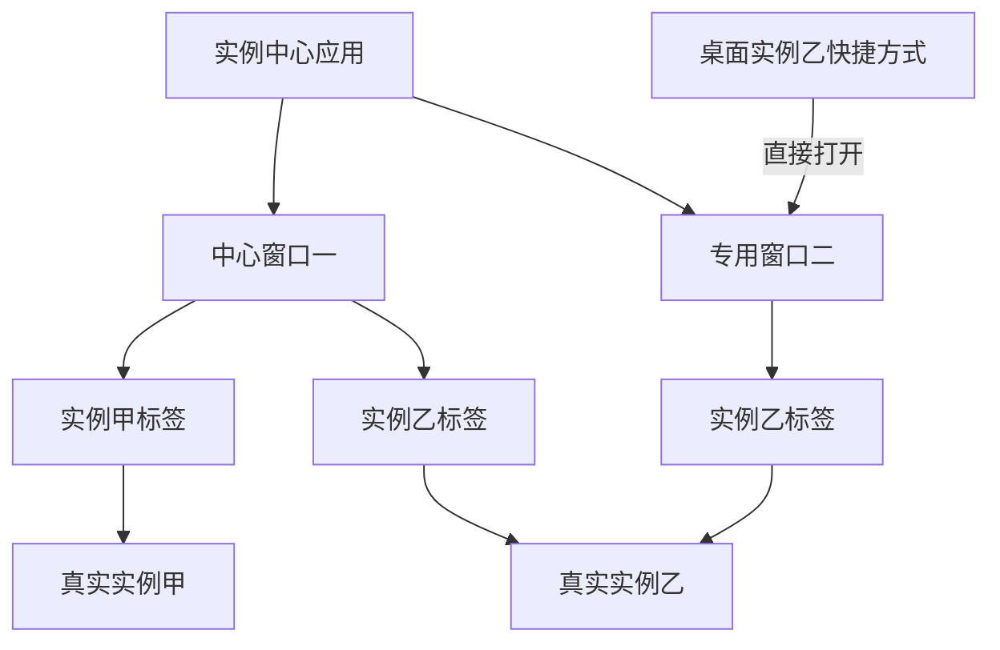

# Blora Panel 策划案 · 第二部分：用户功能、边界与操作体验

版本：v0.3 · 2026-09-08  
定位：产品功能、操作语义与验收基线；本文描述拟实现的行为，不代表已有成品。  
配套文档：[第一部分：技术实现与架构选择](Blora-01-技术架构.md)。

本次修订：将默认/扩展应用、多开窗口、窗口内多实例标签、跨节点实例总览，以及实例“添加到桌面”定义为首版核心行为。

## 1. 产品定位与适用范围

Blora Panel 为用户提供一个浏览器中的服务器管理桌面。用户可以同时打开不同节点的文件、编辑器、实例控制台和任务窗口，在不频繁切换页面的情况下完成多项工作。

绝大部分用户功能都包装成应用。实例中心、文件管理器、编辑器、终端等基础功能是默认安装的应用；后续可以开发扩展应用实现新能力。平台负责桌面和公共服务，应用提供具体工作界面，并统一使用窗口、标签、任务、权限和恢复机制。

默认体验是“一个应用可以多开窗口，一个窗口可以包含多个资源标签，常用资源可以添加到桌面直接打开”。用户可以按自己的工作习惯组合这些入口，不必先选定某台节点才能进入所有功能。

核心价值有三项：

- **工作可以并行。** 编辑配置、查看日志、传输文件、控制实例各自进行，互不占用整个页面。
- **刷新可以接着做。** 打开的窗口、编辑到一半的内容和各应用的工作现场可以恢复。
- **控制结果清楚。** 实例重启、停止和文件任务都有明确阶段、结果与失败处理，不长期停在无法操作的中间状态。

平台管理节点及其资源。被管理服务面向玩家、访客或数据库客户端的端口、域名和网络访问由用户独立配置。业务穿透、VPN、游戏流量转发不属于核心功能，未来可以作为独立插件或应用出现。

网页刷新恢复与实例重启分开定义：前者保护工作现场，后者保证进程控制流程可靠。平台不以“刷新恢复”为由额外承诺 Daemon 更新后所有终端会话永久存活。

## 2. 版本范围与功能总表

M0 为关键原型；M1 为 Linux 核心管理版；M2 为运维增强及 Windows 核心版；M3 为插件生态。Windows 在 M0 即验证进程与终端能力，在 M2 达到正式交付验收。浏览器前端和用户权限模型共用。

| 编号 | 功能 | 用户能完成的事 | 首次交付与边界 |
| --- | --- | --- | --- |
| F01 | 桌面与窗口 | 应用多开、多标签、标签移窗、资源快捷方式、任务栏和吸附 | M1；应用/窗口/标签模型从 M0 验证 |
| F02 | 工作现场恢复 | 刷新后恢复布局、草稿和应用现场 | M1 核心验收，不推迟为附加功能 |
| F03 | 用户与权限 | 多账号、资源授权、只读与操作角色 | M1；普通用户权限按资源限定 |
| F04 | 节点管理 | 添加节点、查看状态、按节点打开资源 | M1；仅管理通信，不转发业务服务流量 |
| F05 | 实例中心 | 聚合全部获准实例、在获准节点创建、多窗口/多标签管理与实例控制 | M1；查看、创建与控制分别授权 |
| F06 | 控制台与终端 | 实例输入输出、交互终端、多标签与重新挂载 | M1；主机 Shell 需要管理员权限 |
| F07 | 文件管理器 | 多选、复制移动、上传下载、压缩解压 | M1；跨节点先提供复制，移动在 M2 |
| F08 | 文件编辑器 | 文本编辑、草稿、撤销重做、保存与冲突处理 | M1；大文件和二进制采用专用查看或下载 |
| F09 | 任务与通知 | 查看后台任务、进度、日志、取消和重试 | M1；取消不自动撤销已完成的副作用 |
| F10 | 监控与进程视图 | 节点/实例指标、系统进程与诊断 | M1 基础指标；M2 完整主机任务管理器 |
| F11 | Docker / Compose | 管理容器、镜像、卷与应用项目 | M2 通用界面；普通用户隔离运行能力在 M1 已具备 |
| F12 | 备份与调度 | 文件备份、保留策略、定时任务与恢复 | M2；应用一致性需明确配置 |
| F13 | 系统管理 | 有限的服务、防火墙和系统定时任务管理 | M2；依操作系统能力提供，管理员专用 |
| F14 | 应用与插件 | 默认应用开箱即用，后续开发扩展应用提供新功能 | M1 统一应用框架与开发接口；M3 第三方分发与安装 |

M1 不要求把所有 1Panel 功能一起完成，但所有已经上线的功能都必须遵守刷新恢复、权限、任务反馈和失败处理规则。

## 3. 全局操作规则

### 3.1 本地反馈与执行结果

点击、选择、移动窗口立即反馈。需要节点完成的操作显示“已提交”“执行中”和真实结果；按钮点击后不把尚未完成的操作直接画成成功。

操作通常只影响对应窗口或资源行，不给整个桌面加全屏遮罩。一个节点离线或一个任务失败，其他窗口仍可使用。

资源标签和面板持续显示节点名称与资源名称，窗口标题随活动标签呈现当前目标；跨节点总览显示“全部可见实例”或实际筛选范围。批量操作、跨节点复制和危险操作再次呈现目标范围，避免把 A 节点的操作执行到 B 节点。切换标签或筛选不会改变一个已经发起的操作所绑定的对象。

### 3.2 容易混淆的动作

| 用户动作 | 实际含义 | 对其他工作的影响 |
| --- | --- | --- |
| 关闭窗口 | 收起这个工作视图 | 不停止实例，不取消后台任务；草稿继续保存 |
| 关闭应用标签 | 关闭这个资源视图 | 同资源的其他窗口保留；不停止实例，草稿和任务仍按规则保存 |
| 结束终端会话 | 关闭该交互会话及其关联 shell，说明可能影响其前台程序 | 不等于停止独立托管的服务器实例 |
| 停止实例 | 对指定实例执行优雅停止及配置的超时策略 | 关联控制台保留退出日志和结果 |
| 取消任务 | 请求停止这项任务的后续工作 | 已完成部分按任务类型保留、清理或补偿 |

这些动作使用不同名称、图标与入口。窗口右上角的关闭按钮不兼任“停止服务器”。

### 3.3 选择、键盘和右键

桌面背景、标题栏、任务栏和文件图标的文字不会因拖动被随意选中。输入框、编辑器、终端选区、错误详情及可复制路径保留合理的文本选择能力。

右键菜单随对象变化：桌面、文件、窗口和任务各有操作。菜单不覆盖输入法或阻碍普通输入控件的编辑。鼠标和键盘都可完成核心工作，支持高对比、焦点提示与减少动效。

| 操作范围 | 默认行为 |
| --- | --- |
| 文件列表 | 单击选择、双击打开；Ctrl/平台对应修饰键多选，Shift 连选；空白区可框选 |
| 文件名称 | F2 重命名；只在文件列表获得焦点且允许操作时生效 |
| 编辑器 | Ctrl/平台对应修饰键 + S 保存当前文件；撤销、重做和文本选择保持编辑器习惯 |
| 终端 | Ctrl+C 优先发送中断；复制通过终端菜单或已验证的专用快捷键完成 |
| 桌面 | Esc 退出当前菜单或手势；应用切换提供任务栏和可配置快捷键 |

浏览器和操作系统保留的快捷键存在边界，应用内窗口切换不承诺占用系统 Alt+Tab。全屏或安装为浏览器应用用于增加可用空间，不被描述为获得完整操作系统控制能力。

## 4. F01：桌面与窗口

### 4.1 窗口与任务栏

桌面包含应用入口、资源快捷方式、任务栏、通知区域和工作区入口。实例中心、文件管理器、编辑器、终端等主要应用默认支持多开窗口，窗口内还可有多个标签。例如同一节点的两个目录可以分别在两个窗口浏览，也可放在一个窗口的两个标签中。

窗口支持拖动、八方向缩放、最小化、最大化、还原、前后层级和边缘吸附。拖至左/右侧显示半屏预览；顶部可最大化；窗口还原记住此前尺寸。屏幕变化后保证标题栏可见，不把窗口遗失在屏幕外。

点击窗口将其置前并恢复合适焦点；点击任务栏中的后台窗口将其激活，点击已激活项可最小化。关闭后可以从最近窗口/应用入口重新打开原工作内容。

任务栏按应用归组，用户可展开选择各个窗口。窗口标题体现当前内容，例如“实例甲 · 节点 A”，不会把所有窗口都只命名为“实例中心”。普通打开应用可激活已有中心窗口；应用图标或任务栏菜单始终提供“新建窗口”，允许独立开展另一组工作。

### 4.2 应用内标签与窗口之间的转换

应用标签位于桌面窗口内部，与浏览器顶部的网页标签不同。一个中心窗口可以同时打开总览及多个实例，实例也可以分布在不同节点。

| 操作 | 用户看到的结果 |
| --- | --- |
| 列表中打开资源 | 保留总览，在当前窗口打开资源标签；已有相同标签则激活它 |
| 在新标签/新窗口打开 | 按明确选择新增一个视图，支持同一资源多视图 |
| 拖动标签 | 调整顺序；固定、关闭、重新打开等操作通过标签菜单提供 |
| 将标签拖出标签栏至桌面 | 标签成为一个独立桌面窗口，当前内容和位置保留 |
| 将标签拖入另一兼容窗口 | 合并为该窗口的标签，继续原有工作 |
| 关闭最后一个标签 | 关闭空窗口，不停止服务器实例或后台任务 |

拖动移窗时，未保存编辑、当前功能页、滚动位置、终端会话和任务引用都跟随标签。菜单提供“移到新窗口”“移到已有窗口”的等价操作，小屏和键盘用户无需依赖拖动。

同一实例可在两个窗口同时查看，例如一边看控制台，一边看设置。运行状态和正在执行的操作同步，各窗口的页面、筛选和滚动互不干扰。重复打开是增加管理视图，不是复制或再次启动服务器。

并非每种应用都必须多标签，例如简单设置应用可以单页显示；但实例中心、文件管理器、编辑器和终端属于明确支持多窗口、多标签的首版应用。

### 4.3 实例“添加到桌面”

实例列表、实例标签和独立管理窗口均提供“添加到桌面”。用户可选择名称、图标和默认打开的功能页，例如概览或控制台；默认名称跟随实例名称，用户自定义别名后保留别名。

激活桌面快捷方式后，直接打开该实例的专用管理窗口。默认复用当前工作区已有的同实例专用窗口；没有则新建。即使某个实例中心里已有该实例标签，也不会只跳回那个标签来代替专用窗口。快捷菜单中的“在新窗口打开”始终允许新增视图。

专用窗口起初只包含目标实例，可以简化总览导航；用户显式添加或拖入其他实例标签后成为多标签中心窗口，并保留原内容。之后再次使用桌面快捷方式，仍按专用窗口规则查找或新建。

快捷方式只是入口：删除图标不删除实例，改图标名称不重命名实例，打开图标不自动启动实例。节点离线时显示离线，资源删除或权限撤销时明确提示；不能把同名的另一实例当作原目标。

同一机制可用于文件夹、文件、容器或其他应用支持的资源，不为每个实例安装一份应用。桌面快捷方式的位置、名称和打开偏好都参与刷新恢复。

### 4.4 边界与体现

移动窗口不等待节点响应。拖动、缩放只对当前手势接管指针；其他情况下仍允许正常滚动和文本操作。最小化降低不可见图表的刷新负担，但保持任务和会话引用。

工作区用于组织一组窗口和资源，例如“生产节点”“测试服”。切换工作区只切换工作现场，不停止另一工作区中的实例或后台任务。

主题、字号、界面密度、快捷方式排列和快捷键偏好按用户保存；影响布局的设备设置单独保存。提供恢复默认布局的入口，执行前保留当前工作区副本，不丢弃草稿。

小屏设备使用单窗口主视图和应用切换栏。原桌面布局保留，回到大屏恢复，不用手机布局覆盖桌面布局。

## 5. F02：网页刷新与工作现场恢复

### 5.1 对用户的核心承诺

同一用户在正常浏览器环境刷新当前页面后，继续看到原来的工作内容。用户不需要为了刷新先手动“保存桌面”，也不需要为了保护未完成编辑而先保存到服务器。

恢复清单如下：

| 场景 | 刷新后的表现 |
| --- | --- |
| 多个窗口 | 原应用、中心/专用资源窗口模式、位置、尺寸、层级、吸附、最小化和活动窗口恢复 |
| 正在编辑但未保存到服务器 | 恢复编辑后的正文、未保存标识、光标、选区、滚动和可用撤销重做记录 |
| 多标签、多分栏 | 恢复每个标签归属的窗口、顺序、当前标签、分栏比例和各自视图；包括刷新前刚拖出的窗口 |
| 实例中心 | 各总览的独立筛选、选择与排序，以及各实例标签当前所在的功能页 |
| 桌面快捷方式 | 恢复实例等资源入口、位置、名称与打开偏好；不因此执行实例启动 |
| 文件浏览 | 恢复目录、前后浏览记录、树展开、选中项、排序、筛选和滚动位置 |
| 终端 | 重新连接原会话，恢复屏幕检查点并补齐后续输出；不新建一个空白终端替代 |
| 表单填到一半 | 恢复非凭据字段和步骤；未提交的操作仍为未提交 |
| 打开的操作对话框 | 恢复内容；涉及执行、覆盖或删除时，重新检查条件并由用户继续确认 |
| 正在执行服务器任务 | 恢复原任务的当前进度，既不取消也不重复创建 |
| 正在从本机上传文件 | 恢复任务与已传进度；浏览器不再提供源文件时提示重新选择后续传 |

以用户已完成输入的字符、已提交的选择和窗口操作为验收单位，包括操作后立即刷新。不能用“等自动保存两秒以后才算”回避最后一次操作的保护。

### 5.2 三种保存状态要分清

- **草稿已保护**：当前编辑可供本浏览器正常刷新恢复，服务器文件可能仍未修改。
- **已同步到工作区**：这份现场的云端副本已经更新，可供其他设备选择打开。
- **服务器文件已保存**：节点确认文件写入完成，保存后的版本成为新的编辑基线。

这些状态放在编辑器或工作区的合适位置，不每次输入都弹通知。同步离线不阻断本地编辑；保存到服务器失败时保留正文与重试入口。

默认同步布局和资源引用；需要跨设备携带草稿正文与终端屏幕时，用户开启“同步工作内容”。该开关不影响本浏览器的完整刷新恢复，也不会自动把草稿保存到服务器文件。

### 5.3 明确边界

恢复的是应用工作现场，不是浏览器或操作系统的任意内部状态。正在拖动时刷新会终止手势，恢复可用布局；输入法候选窗不能原样恢复，但已经进入应用的文字应保留。系统文件选择器、浏览器下载保存位置、已撤回授权不能靠快照恢复。

密码、验证码、私钥导入字段不进入普通现场保存；离线草稿可能包含配置机密，应按用户和工作区隔离，并提供清理入口。显式退出账号会提示处理未同步草稿，完成后清理该账号本地可访问的现场；重新登录可恢复已同步副本。

浏览器存储不可用、配额不足或用户清除站点数据时，系统明确提示恢复保护不可用并允许导出。不能在写入失败时继续显示“已保护”。正常使用不把额外确认作为刷新流程的一部分；只在确有未保护内容时给出离开提示。

### 5.4 跨设备和多标签页

同一浏览器标签页刷新是严格验收场景。换设备恢复已经同步的工作区副本；未同步的本地内容不会凭空出现在另一设备。

多个浏览器标签页分别维护现场，不互相拖动窗口。用户可以显式复制工作区或打开云端副本；存在冲突时保留分支，不用较旧副本覆盖新编辑。

节点离线时保留窗口与草稿并显示“节点离线”；文件被删除时保留草稿、提供另存或导出；权限变化后不继续执行旧权限下的操作。

## 6. F03：多用户与权限

### 角色与范围

| 角色 | 可见与可操作范围 |
| --- | --- |
| 平台管理员 | 用户、节点、授权和平台配置；按审计规则管理全局资源 |
| 节点管理员 | 被授予节点的实例、主机终端、系统管理等；不自动管理全平台账号 |
| 实例操作员 | 被分配实例的控制台、启动停止、文件或终端；具体动作可分别授权 |
| 只读成员 | 获准资源的状态、日志和文件查看；无写入、终端输入或控制权限 |

角色是快捷授权模板，最终权限按具体资源与动作判断。查看日志不自动获得 shell，编辑文件不自动获得强制结束进程，实例控制权不自动获得宿主机 Docker 管理权。

“查看实例”“控制已有实例”“在节点创建实例”是独立权限。实例中心可聚合所有被授予查看权的实例；创建向导只提供允许创建的目标节点。用户无需拥有整台主机的管理权限即可管理获准实例。

### 操作体现

用户只看到有权限的节点和资源。无权限功能可按场景隐藏，或以“需要某项权限”解释禁用原因；不能只靠前端限制。

管理员在资源详情中查看授权，授予动作范围，并可撤销。撤销后现有实时流终止、后续请求拒绝。已下载到本地的文件或内容无法远程收回，这一点不能用界面清理作虚假保证。

普通用户运行自定义程序时采用支持的隔离模式。原生进程模式面向可信团队或明确配置的系统身份；界面不把“分配了实例目录”描述为对任意恶意程序的完整隔离。

操作审计可按用户、节点、资源、动作和时间检索。默认记录事件与结果，不将密码或全部编辑正文作为审计内容。

## 7. F04：节点管理

### 用户能力

管理员添加节点，获得有时效的一次性登记方式；节点主动连接后显示主机信息、平台版本、能力与连接状态。支持命名、分组、标签、凭据轮换、断开和移除。

状态至少区分“在线”“连接异常”“离线”“维护中”。离线时显示最后联系时间；上次采集的指标明确标记为旧数据。

节点卡片提供打开文件、实例列表、终端或监控的快捷入口。从节点卡片进入实例中心时，该总览标签默认筛选此节点；具体资源标签始终记住自己的节点，不随其他筛选器暗中切换。同一窗口仍可继续打开其他节点的实例标签。

### 边界与操作体现

节点能被面板管理，不等于其业务服务已对外开放。节点详情可以展示用户配置的业务地址或端口，但不自动为服务开启穿透。

从面板移除节点默认解除管理关系，不删除主机文件或卸载服务。执行影响节点资源的清理必须是另一个明确的操作。进入维护不等于自动停止节点所有现有业务。

能力不足时显示具体原因，例如没有容器运行时、平台不支持对应系统应用；不让用户进入一个注定无法完成的操作流程。

## 8. F05：实例中心与可靠重启

### 8.1 全部获准实例总览与创建

从应用入口打开实例中心，默认展示当前用户所有有权查看的实例，跨节点聚合。既包括自己创建的，也包括其他人授予权限的实例；不要求逐个进入节点寻找。

总览支持名称搜索、节点、分组、标签与运行状态筛选，以及列表/卡片等视图。只读实例可以查看，具体控制按钮根据权限提供；列表、统计和批量选择只涉及当前用户可见资源。

“创建实例”从当前应用内进入，列出有创建权限且能力匹配的节点。选择节点后配置模板、运行模式、工作目录、参数和资源限制。仅能查看节点或控制已有实例，不代表可以在该节点继续创建实例。

提交时重新检查权限和配额。创建成功后默认打开新实例的管理标签，各个总览按自己的筛选条件更新。创建配置与启动程序分开，若提供“创建后启动”，必须是用户明确选择的选项。

每个总览标签保存自己的搜索、筛选、选择和滚动状态。一个窗口切到“节点 A”，不会修改另一个窗口的“全部可见实例”或改变已有实例标签的目标。

### 8.2 多窗口、多标签与实例专用窗口

实例中心支持同时打开多个窗口；每个窗口可保留总览并打开多个实例标签。不同标签可跨节点，同一实例也可在多个视图中打开。

例如：窗口一的标签为“全部实例、实例甲、实例乙”；窗口二只看实例甲的设置；桌面上的实例乙快捷方式打开一个专用管理窗口。窗口一查看实例甲日志、窗口二修改实例甲设置时，运行状态一致，当前页面和滚动位置各自独立。

实例标签内部提供概览、控制台、文件、监控、设置等功能导航，按授权显示；这与上方用于切换不同实例的标签栏分开。文件等功能可以使用对应默认应用的嵌入视图，并提供“在文件管理器/编辑器中打开”的入口，保持同一资源和草稿。

“在新窗口打开”增加一个视图；拖出标签则移动当前视图。两种操作均不复制、重启服务器实例。桌面快捷方式按第 4.3 节直接打开实例专用窗口，无须先回总览再选择实例。

### 8.3 实例概念与配置

实例是平台明确托管的一组程序及其运行配置。支持名称、节点、工作目录、启动参数、环境、运行身份、资源限额、停止方式、停止期限和自动启动策略。

模板可以预填游戏或通用程序的启动与停止方式。用户可以管理任意符合运行条件的程序，但平台不自动理解每个程序的业务健康状况。

系统进程列表中看到一个进程，不表示它已经被接管为实例。接管外部已有程序属于单独能力，不通过“发现 PID”隐式完成。

### 8.4 按钮语义

| 按钮 | 行为 |
| --- | --- |
| 启动 | 创建一次新的运行；已有运行或状态不明时不重复创建 |
| 停止 | 按模板优雅停止，按设定期限和策略处理超时 |
| 强制结束 | 直接请求结束本次归属运行；提示可能丢失应用未落盘数据 |
| 重启 | 完成旧运行停止和退出确认，再启动新运行 |

普通进程建议优雅停止默认 30 秒，特定游戏模板可设 120 秒；可配置。默认允许超时升级强制结束，也可改为只报告失败。用户可以在实例设置中看到策略，在停止过程中看到实际截止时间。

“运行中”表示进程存活；只有配置了相应检查时才显示“服务已就绪”。控制台出现某一行文本或端口占用不应自动替代完整的退出确认。

### 8.5 重启的完整操作体验

用户点击重启后立即得到一个任务入口，实例行和控制台同步显示阶段：

1. 正在请求正常停止，展示使用的停止方式及剩余等待时间。
2. 超时后显示“正常停止未完成，正在强制结束”，或根据策略报告超时。
3. 显示“正在确认旧进程退出”。
4. 确认退出后显示“正在启动”。
5. 最终显示重启成功，或精确说明失败发生在哪一步。

点击按钮产生一个操作，不因刷新或网络响应丢失重复重启。多人同时控制同一实例时显示正在执行的操作和发起者，冲突操作不能互相穿插。

同一实例的其他窗口同步显示这次操作。确认框固定显示发起时的实例和节点；期间切换标签不会把重启目标变成新标签的实例。批量控制逐项展示结果，不把部分失败的批次笼统标为全部成功。

### 8.6 出错时应如何表现

- **旧进程仍存活**：进入“停止失败”，展示残留进程、系统错误和检查入口；新实例不会启动。
- **旧进程已停止但新进程启动失败**：明确显示“启动失败”，保留启动日志，不笼统显示重启失败后仍在运行。
- **节点失联**：显示“失联，等待确认”，不把超时当作已经停止。
- **命令已接受但结果未返回**：继续查询原操作，不要求用户通过反复点击碰运气。

停止失败不会锁住整个桌面。检查日志、打开文件、管理其他实例仍可进行。用户有权限时可以再次请求强制结束、检查主机或调整配置。

取消重启表示尽力取消尚未执行的后续阶段。例如旧实例已停止而新实例尚未启动，可取消再次启动；已经发生的停止不会自动撤销。

## 9. F06：实例控制台与交互终端

实例控制台默认展示实例输出，提供独立命令输入框、日志搜索、复制、跟随输出和暂停自动滚动。独立输入框中尚未发送的内容作为草稿恢复。

交互终端用于 shell / TUI；普通用户只能进入获准的隔离环境，宿主机终端由管理员使用。终端可以多标签、分栏，标题持续显示目标节点和身份。

关闭终端窗口默认只是关闭视图。后台会话保持到用户明确结束、进程退出或管理员按可见策略回收；可从会话列表重新打开。存在清理期限或配额时，创建和重新挂载界面应能看到。

刷新重新挂载原会话，不自动重发之前的输入。输出记录超出保留范围、会话已退出或节点自身维护导致会话失效时明确提示原因，不偷偷创建一个新会话冒充恢复成功。

同一会话允许多位观察者，默认只有一个输入与尺寸控制者。其他窗口显示“只读观察”，可申请接管；不能让两个人同时输入时毫无提示。

交互终端中的按键可能已经即时发往远端，与“尚未发送的独立命令输入框”不同。刷新只恢复会话和画面，不再次执行屏幕上的历史命令。

M1 提供已接入节点的本地终端和隔离实例终端。通用 SSH 跳板、任意远端主机的密钥托管与会话管理作为后续独立应用范围，不混入节点接入的必需步骤。

## 10. F07：文件资源管理器

### 10.1 基本操作

文件管理器提供路径导航、前进后退、目录树、图标/列表视图、排序筛选、框选、多选、重命名、新建、复制、移动、删除、上传下载、压缩和解压。

选中项、目录滚动与打开方式符合桌面习惯。大量文件时仍能滚动和操作，加载更多数据不让整个窗口失去响应。打开文件默认进入对应应用；可将常用目录固定到桌面。

### 10.2 拖放和剪贴板规则

| 操作 | 默认含义与反馈 |
| --- | --- |
| 同节点两个目录间拖动 | 默认移动；允许修饰键切换为复制；拖动提示显示将执行的动作 |
| 跨节点拖动 | M1 默认复制，提示两个节点与目标目录；不会隐含删除源文件 |
| 从本机拖入浏览器 | 上传到当前目录，显示上传清单与任务 |
| 复制/剪切后粘贴 | 内部剪贴板保存资源引用；粘贴时重新检查存在性、版本与权限 |
| 剪切但尚未粘贴 | 源文件只是视觉标记，未被删除；刷新恢复标记及引用 |

跨节点移动在 M2 提供，并明确显示复制、校验和源删除三个阶段。跨节点操作不是原子事务：目标已复制但源删除失败时，显示“两处均保留”，而不是单纯失败或假装完成。

同名文件先选择跳过、保留两份或覆盖，可针对本批应用；默认不静默覆盖。异步任务期间目标位置可以显示带进度的待完成项，只有实际提交成功才作为完整文件展示。

### 10.3 删除与恢复

可支持回收区的节点，普通删除进入对应根目录下的回收区，受配额和保留时间管理；恢复需要目标权限及冲突处理。无法回收的目标明确标识为永久删除，并在执行前展示范围。

用户不能通过路径输入、快捷方式、符号链接或压缩包越过授权根目录。系统目录访问与普通实例目录访问是不同权限。

### 10.4 上传、下载与后台执行

上传有总量、已传量、速度、暂停或等待原因；刷新恢复任务。需要重新选择本地文件时说明用途，验证为同一文件后续传，不让用户误以为服务端会凭空拥有剩余数据。

节点内复制、解压以及跨节点复制一旦被服务器接受，关闭网页后继续。下载到本机使用浏览器下载器时，面板只展示服务端准备和传输状态，不承诺控制浏览器的保存对话框。

失败任务提供可理解原因，例如磁盘满、权限不足、来源变化、节点失联，并标明临时文件或部分结果的处理方式。

## 11. F08：文件编辑器

编辑器支持文本高亮、查找替换、多光标、多标签、分栏、撤销重做、编码和换行格式信息。首次打开时显示节点、文件路径和读写状态。

### 草稿与保存

编辑后自动保护草稿，标题显示未保存标记。Ctrl+S 保存到服务器，成功后更新文件基线；保存中仍可编辑，后续输入保持为下一版本未保存内容，不能被先前保存响应覆盖。

关闭编辑窗口默认保留草稿，重新打开继续编辑；明确“放弃更改”才删除该份草稿。切换节点或文件不会顺便提交未保存内容。

同一工作区的多个窗口打开同一文件时共享正文，保持各自视图。同一文件在其他设备、其他用户或外部程序中被修改，保存时展示冲突，允许比较、合并、另存或重新加载；重新加载会丢弃当前内容时必须明确提示。

### 刷新后的行为

正文、撤销重做位置、光标选区、滚动、折叠、查找条件和布局继续保留。恢复的是用户正在编辑的版本，不是从服务器重新下载旧内容覆盖它。

文件被删除或节点离线时，草稿仍可查看和导出；重新保存需等待资源可达并重新校验权限。只读文件可以查看和复制，不能通过编辑草稿获得写入权限。

### 编辑边界

支持的可编辑文件大小、编码和历史记录预算以产品设置明确展示。超出范围提供只读预览、分段查看或下载，不能加载到浏览器崩溃。二进制文件不按普通文本强行保存。

数据库、游戏存档等文件可能需要应用停机或专用工具处理。普通文本编辑器不保证任意运行中数据文件的应用一致性。

## 12. F09：任务与通知中心

任务中心汇总实例控制、文件操作、传输、镜像拉取和备份等工作。展示任务名称、节点、资源、发起者、当前阶段、耗时、进度、结果与日志。

用户可以关闭任务窗口，任务仍执行；在任务栏或通知区看到后台数量。完成通知可跳回结果位置，不抢走正在编辑窗口的键盘焦点。浏览器系统通知由用户主动启用，站内任务状态始终可用。

### 状态与动作

| 状态 | 用户理解 | 可提供的动作 |
| --- | --- | --- |
| 排队中 | 已接受，等待执行资源 | 查看、取消 |
| 执行中 | 正在实际处理 | 查看日志、按任务能力取消 |
| 等待节点 | 目标不可达，暂不能继续或确认 | 查看原因、取消尚未执行部分 |
| 等待本机文件 | 需要用户重新提供上传来源 | 选择同一文件续传、取消 |
| 正在取消 | 取消请求已接受，等待安全停止点 | 查看，不伪造瞬时取消成功 |
| 成功 | 实际结果已确认 | 打开结果、查看日志 |
| 失败/中断 | 未达到目标或无法安全继续 | 查看已完成部分、按能力重试 |

不能计算总量的任务显示阶段和已处理量，不编造百分比。重试创建有关联的新尝试，先检查已有结果，不能重复产生不可逆操作。

任务取消的影响在操作前说明：复制通常清理未提交的目标，已完成子项可能保留；删除已经完成的部分不能仅靠取消恢复；停止实例后取消重启不会把旧进程复活。

用户默认只查看自己的任务和获准资源；管理员按授权查看团队任务和审计。

## 13. F10：监控与系统进程

M1 提供节点与实例 CPU、内存、基础磁盘和网络指标，展示采集时间；M2 提供完整主机任务管理器和更丰富的进程视图。

图表实时更新，但用户拖动其他窗口时不被图表刷新打断。图表最小化后可以降低刷新频率；再次打开补齐可用历史或标明缺口。

实例窗口展示归属该实例的资源情况。宿主机总量不被当作单实例用量；统计口径和不可用指标明确标识。

管理员可查看系统进程并请求终止。该功能与托管实例管理分开：结束一个外部系统进程并不创建启动配置，也不赋予平台自动恢复它的能力。危险目标展示名称、身份与影响，不能只按“占用了端口”就杀死。

## 14. F11：Docker 与 Compose 应用

Docker Center 在 M2 提供容器列表、状态、日志、控制台、镜像、卷、网络和 Compose 项目管理。节点没有所需组件时显示安装依赖和能力状态，不隐式安装或改变宿主机。

用户可以编辑 Compose 配置并主动应用，查看拉取、创建、启动、健康检查等阶段。编辑草稿不会自动部署；保存配置与应用配置是两个动作。

普通实例用户只能管理获准的隔离实例。宿主机 Docker 管理、任意挂载、任意 Compose 属于高权限能力，不随普通文件编辑权限开放。

删除容器、删除项目、删除持久卷使用不同选项。默认保留持久数据；删除卷必须明确展示目标。应用更新失败保留阶段结果与日志，不承诺任何 Compose 项目都能一键无损回滚。

M1 使用容器隔离普通实例所需的运行能力已经存在；M2 增加面向管理员的通用管理界面，两者不是同一交付项。

## 15. F12：备份与定时任务

备份可以选择实例文件或授权目录，配置目标、保留策略、压缩方式和时间。后台任务展示来源、范围、执行策略、结果及可恢复版本。

运行中备份可能需要先请求应用保存、暂停或停止。结果明确注明采用的方式；文件打包成功不自动代表数据库或游戏世界已获得一致性备份。

恢复前展示覆盖范围，可先恢复到新目录。恢复到当前实例目录时检查运行状态、权限和冲突，不在后台悄悄覆盖正在使用的数据。

定时任务支持明确时区、下一次执行时间、错过执行后的策略和重叠策略。默认避免同一资源的同类任务并发重叠。节点离线时记录错过或等待，不在恢复连接后盲目补跑全部历史计划。

跨节点复制、定时重启与命令执行复用同一任务反馈和授权规则；计划创建者失去权限后不能借旧计划继续越权执行。

## 16. F13：有限的主机系统管理

M2 按节点能力提供系统服务、定时任务与有限防火墙管理。操作围绕具体主机对象，不试图用一个通用界面完整覆盖所有发行版和操作系统。

防火墙变更展示预计影响和差异；涉及管理连接时使用自动回滚保护及确认期限，避免操作后永久失联。导入已有规则与平台生成规则分别展示，不静默覆盖主机现有配置。

主机 Shell、系统服务修改与系统进程终止为管理员能力。对普通用户只提供其资源所需的操作。

防火墙应用可以帮助用户显式配置业务端口，但不会自动替被管理服务建立穿透，也不改变核心平台只负责管理通信的边界。

## 17. F14：内置应用与未来插件

### 17.1 应用是主要功能交付单位

实例中心、文件管理器、编辑器、终端、任务中心、监控、节点管理、用户与权限、设置等均作为应用提供。基础应用默认安装，用户第一次进入桌面即可使用获准功能，无需先到应用市场补装。

桌面、窗口宿主、任务栏、通知服务、授权与管理连接属于平台基础。任务中心的完整界面是应用，托盘进度是平台服务；关闭任务中心不会使任务无法执行。节点和用户管理的界面是系统应用，关闭它们也不会停止鉴权或节点连接。

| 类型 | 安装和展示 | 使用方式 |
| --- | --- | --- |
| 默认业务应用 | 随对应版本安装，按用户资源权限展示 | 大多数支持多窗口；实例、文件、编辑器和终端支持多标签 |
| 默认系统应用 | 默认安装，部分为系统必需 | 根据管理员权限显示；关键入口可限制卸载或禁用 |
| 扩展应用 | 后续开发并安装，用于新功能 | 使用统一桌面、窗口、标签、任务和恢复机制 |

默认应用和扩展应用在操作体验上遵守同一套规则。应用可以提供总览入口、资源专用入口、资源右键动作及桌面快捷方式；不必为每个实例复制一份应用，也不需要每次增加应用就重写桌面。

### 17.2 开发和扩展的阶段

M1 提供统一应用清单、窗口/标签接口、资源打开协议、工作现场适配与最小参考应用，并用它们实现默认应用。M3 再提供面向第三方的安装、分发和完整管理能力；应用化不是留待 M3 再实现的外观改造。

M3 提供第三方应用安装、权限展示、升级、禁用与卸载。安装时说明需要访问哪些节点、文件和执行能力；应用界面能打开不代表自动拥有后台特权。

插件禁用后停止接受新任务，对已有任务按其策略收敛；卸载默认保留用户数据并说明清理选项。应用版本升级需要迁移旧窗口状态，失败时保留可恢复记录。

业务穿透、VPN、游戏专项管理等未来扩展由插件各自声明依赖、服务端口、配置和生命周期。没有安装相关应用时，核心不会运行这类服务。

扩展应用不保证全部支持任意标签互拖，只在双方声明兼容的资源/视图类型之间提供移动；其他情况通过“打开方式”打开对应资源。基础应用与扩展应用的信任和授权不同，但不能因此让扩展应用天然失去多窗口和刷新恢复能力。

## 18. 故障与恢复的统一呈现

| 情况 | 页面应怎样表现 | 不允许的表现 |
| --- | --- | --- |
| 刷新 | 自动恢复工作现场并校准实时状态 | 未保存正文消失，仅重新打开原文件 |
| Master 短暂不可用 | 本地工作继续，远程操作提示连接状态 | 立即把所有节点实例标记停止 |
| 节点断线 | 相关窗口保留内容并标记离线 | 全桌面锁住或假装任务已成功 |
| 实例停止超时 | 阶段明确，按策略升级或进入失败 | 永久关闭中、无法诊断或重复启动 |
| 保存冲突 | 保留双方版本，提供比较与选择 | 用旧响应覆盖新输入 |
| 上传刷新后丢失源授权 | 保留已传进度，选择文件后续传 | 把任务标为成功或直接从头上传 |
| 本地保护失败 | 显示原因，保留当前内容并允许导出 | 继续显示已保护或清空草稿 |
| 权限变更 | 终止受影响操作，解释授权变化 | 依赖旧快照继续访问 |
| Daemon 自身维护 | 展示受影响资源和实际恢复结果 | 将新的 shell 当作原会话无缝恢复 |
| 切换标签时有待确认操作 | 确认框继续展示原资源，操作保持原目标 | 把原操作执行到刚切换的实例 |
| 桌面快捷目标失效 | 标记删除、离线、缺少应用或权限变化 | 按名称打开另一实例或自动创建新实例 |

## 19. 端到端验收场景

### 场景一：多窗口编辑后立即刷新

在节点 A 打开实例控制台与文件管理器，在节点 B 打开编辑器。调整窗口、选择文件、编辑正文但不保存到服务器，并执行一次撤销；立即使用 F5 或浏览器刷新按钮。

通过标准：所有窗口、选择、正文、编辑历史位置和视图恢复；服务器文件仍未被擅自修改；原终端会话继续；节点标识始终正确。

### 场景二：重启遇到拒绝退出的旧进程

对忽略正常停止且派生后代的测试实例执行重启，同时在另一窗口继续编辑和传输文件。

通过标准：用户看到正常停止、强制结束和验证阶段；能退出则再启动，无法退出则明确失败且阻止重复运行；其他工作始终可用。

### 场景三：关闭网页时有两种后台任务

节点正在解压文件，本机正在上传另一份文件。关闭网页，再回到相同工作区。

通过标准：解压根据服务器实际结果显示完成或执行中；上传保留已传记录，必要时选择同一文件继续；不把两种任务都假定为可以脱离客户端完成。

### 场景四：多用户与文件冲突

操作员编辑获准实例的配置，管理员同时从另一端修改该文件并撤销操作员的终端输入权限。

通过标准：编辑保存进入版本冲突处理；终端输入终止，视图解释原因；草稿不跨账号显示；平台不通过某个仍打开的窗口绕过撤销。

### 场景五：混合负载与节点掉线

工作区打开多个窗口，两个终端持续输出，同时跨节点复制文件；传输过程中目标节点掉线。

通过标准：拖动、选择和本地编辑保持可用；目标任务显示等待或失败原因；控制其他节点仍可进行；目标恢复后校准状态，不重复生成完整副本或误删源文件。

### 场景六：实例中心、窗口与桌面快捷方式

用户获准查看节点 A 的实例甲和节点 B 的实例乙，仅在节点 B 有创建权限。打开实例中心看到两者，在窗口一分别打开甲、乙标签，再开窗口二查看甲的设置。

将实例乙添加到桌面，通过快捷方式打开专用窗口；把窗口一中的乙标签拖到一个新窗口，随后立即刷新。再移除桌面快捷方式，并检查实例列表。

通过标准：总览聚合两台节点的获准实例；创建向导只允许节点 B；甲的两个视图状态同步且导航独立；快捷方式直接打开乙的管理窗口；刷新恢复所有窗口和标签归属；删除快捷方式后真实实例和其他视图保持正常。

### 场景七：扩展应用使用统一桌面能力

通过开发环境加载最小参考应用，打开两个窗口，在各窗口建立标签，创建一个资源快捷入口并刷新工作区。

通过标准：无需修改桌面核心即可注册与启动；窗口、标签、快捷入口及应用现场恢复；未授予的节点操作被拒绝。此场景验证 M1 的应用框架，不等同于已交付 M3 的第三方应用市场。

## 20. 产品交付准则

新应用进入核心版本前必须回答：用户能完成什么、操作哪些资源、需要哪些权限、支持哪些窗口和标签行为、资源如何直接打开、刷新后恢复什么、失败后如何继续。无法回答时不以一个可点击页面视为功能完成。

第一版的完成标志是：主要功能以默认应用提供，用户可跨节点总览实例，在多窗口和多标签间自由组织工作，从桌面直达常用实例，刷新后继续原工作，实例重启有明确结果，任务和权限边界始终可信。功能数量、动效数量和技术名词不替代这些验收。
